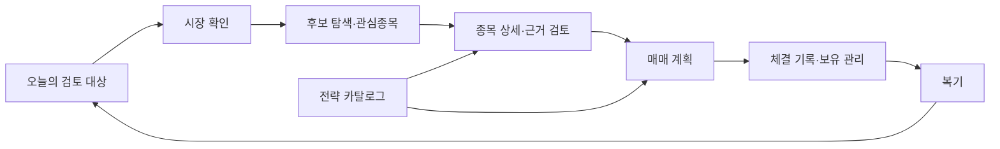
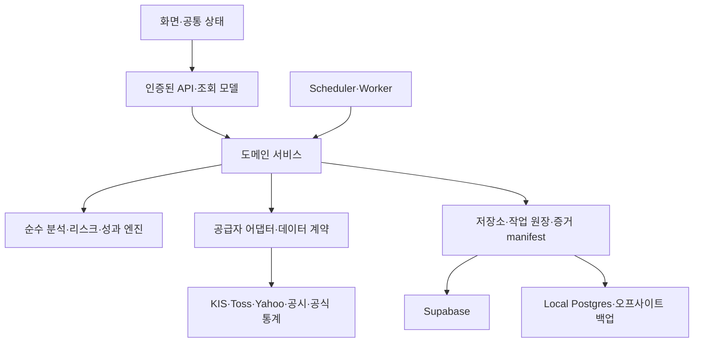

# MTN 전면 리뉴얼 계획

작성일: 2026-09-05 · 개정 2: 종가베팅 포함

1차 기준: `1b29470` · 추가 검토: 2026-09-05 20:49 KST의 `13d6347` 이후 작업 폴더 · 관측된 운영 SHA: `6f4c1c5`

**권고: 분석·리스크·성과 검증 자산을 보존하고, 사용자 작업 흐름·데이터 계약·작업 실행 경계를 단계적으로 재구성한다.** 첫 2주에는 재현성·시장 맥락·복구 기반을 정비하고, 이후 종목 상세를 중심으로 발굴부터 복기까지 연결한다.

이 문서는 구현 전 계획이다. 현재 프로그램의 코드·DB·운영 설정 변경이나 배포를 포함하지 않는다. 확인 사실, 재현 결과, 미검증 가설은 [검토 근거 문서](/Users/mantori/vibecoding/MTN/docs/MTN_RENEWAL_REVIEW_2026-09-05.md)에 구분했다.

종가베팅(`/strategies/kr-closing-bet`, `kr-closing-bet-v1.1`)의 화면·선정·익일 평가·저장·자동화를 추가 검토했다. 종가베팅과 관련 설정/테스트 27개 파일은 관측된 운영 SHA의 소스와 같았다. 실제 장중 수집·발송 성공과 DB migration 적용은 별도 검증 대상이다. 기존 일일 집계·월간 백테스트·시장 전달·로딩 표시의 작업 폴더 수정 상태도 이번 개정에 반영했다.

## 1. 목표와 범위

기본 사용자는 한국·미국 시장을 함께 검토하는 개인 투자자다. 기존 README의 목적에 따라 MTN을 종목 선별·투자 계획·매매 기록 도구로 유지한다. 예산은 기존 인프라를 활용하는 것을 기본으로 하고, 유료 데이터·인프라 도입은 필요성과 비용을 측정한 뒤 결정한다.

사용자가 매일 답해야 할 질문을 제품의 중심에 둔다.

1. 오늘 선택한 시장과 계좌에서 무엇을 검토해야 하는가?
2. 이 종목이 후보가 된 근거는 무엇이며, 데이터는 언제 관측되었는가?
3. 진입·무효화 조건과 허용 손실을 반영한 계획은 무엇인가?
4. 계획과 실제 체결이 어떻게 달랐고, 다음 판단에서 무엇을 고쳐야 하는가?

리뉴얼 범위는 전체 정보구조·공통 디자인, 핵심 화면, 기존 7개 투자전략(종가베팅 포함), API와 데이터 계약, 분석·연구 재현성, worker와 배포·복구 절차다. 자동 주문, 다중 사용자 서비스, 구독·결제, 추가 투자 전략 개발은 이번 완료 조건에 넣지 않는다. 다중 사용자 서비스가 목표로 바뀌면 인증·계좌 소유권·행 단위 권한 설계를 먼저 다시 산정해야 한다.

## 2. 현재 상태에 대한 판단

| 영역 | 현재 확인 | 리뉴얼 판단 |
|---|---|---|
| 규모 | 현재 페이지 파일 34개, API route 110개, 단위 테스트 파일 184개, E2E spec 37개, Supabase migration 91개 | 종가베팅 추가분 포함. 미추적 신규 소스와 redirect 페이지도 집계에 포함된다. |
| 기술 기반 | Next.js 16.2.10, React 19.2.4, TypeScript, Supabase, Local Postgres | 기존 기반을 유지하고 구조를 개선한다. 프레임워크 교체는 현재 문제의 직접 해결책으로 선정하지 않는다. |
| 품질 기준선 | 추가 검토에서 lint·typecheck·184개 단위 테스트 파일·API 인증 정적 검사·production build 통과 | release preflight 개발 검증은 47개 작업을 인식했다. 작업 폴더가 dirty라 releaseEligible=false이며 배포 승인 검증 통과로 보지 않는다. |
| 사용자 흐름 | 1차 검토의 선택 E2E 32개 통과, 추가 종가베팅은 정적 렌더·조회 계약 테스트 통과 | 종가베팅 전용 브라우저 E2E는 없다. 1차 결과를 추가 화면의 모바일·키보드·실제 DB 검증으로 확대하지 않는다. |
| 제품 연결 | KR 계획→포트폴리오 시장 전달과 정상 로딩 지연 표현 수정 반영. 공통 시장/URL 동기화와 종목 상세 연결은 추가 작업 필요 | 수정된 재현 경로는 보존하고 남은 맥락 계약을 통합한다. |
| 분석 정확성 | 기존 일일 집계·월간 비중 드리프트 수정은 작업 폴더에서 검증. 종가베팅은 원천 시각 누락 시 FULL 후보 통과를 새로 재현 | 기존 수정은 회귀 검증·배포 확인으로 전환하고, 종가베팅 원천 시각 계약을 최우선 보강한다. |
| 운영 | 로컬 세션 API는 200으로 회복, release는 SHA 미설정 503. 운영 종가베팅 조회/cron 미인증 401, 운영 SHA 변경 확인 | 기존 500을 현재 장애로 적지 않는다. 웹·worker·DB·47개 HTTP 작업의 실제 적용 상태와 실행 성공을 확정한다. |

1차 검토 기준 주요 소스·실행 스크립트는 95,130줄이었다. 일일 스캐너, 금 대시보드, CAN SLIM 화면처럼 큰 파일이 있으나 줄 수 자체가 결함은 아니다. 조회·계산·저장·표현이 함께 바뀌는 부분을 분리 대상으로 삼는다.

## 3. 유지·통합·교체 결정

| 결정 | 대상 | 실행 원칙 |
|---|---|---|
| 유지 | 기술 분석 엔진, 리스크 gate·포지션 크기 계산, 자본 검증, 체결·복기 기록 | 동일 입력 결과를 보존하는 회귀 검증 후 연결한다. 결함 수정은 정책 버전을 구분한다. |
| 유지·확장 | 추천 근거 manifest/hash, D5/D20/D60 성과, 비용 모델, 공식/폴백 표본 분리, cohort 검증 | 이미 있는 기능을 전략·연구 결과까지 확장한다. 새로 구축하는 것으로 산정하지 않는다. |
| 유지·보강 | Supabase scheduler 원장·slot claim, DB 작업 큐, 알림 receipt, CI, Supabase 백업 | 작업 완료 소유권·멱등성·전체 복구 절차를 보완한다. |
| 유지·통합 | 종가베팅 LIVE/WATCH/FINAL/REPLAY, 원본 스냅샷, 진입 조건, 익일 가상 평가, 발송 영수증 | 세션·유효기간·철회·평가 버전을 공통 계약에 추가하고 종목/운용/복기로 연결한다. |
| 통합 | 시장·종목·계좌 상태, 데이터 신뢰도, 오류/빈 결과 표현, 스캐너 진입점 | 사용자에게 같은 데이터와 같은 상황이 같은 의미로 보이게 한다. |
| 재구성 | Stock360, 후보→계획→보유→복기 연결, desktop/mobile 탐색, 큰 화면의 통신·표현 결합 | 공통 작업 흐름을 먼저 구현하고 화면을 차례로 전환한다. |
| 점진 교체 | `lib`에서 API route를 호출하는 구조, 모호한 Supabase fallback, worker 완료 저장 조건 | 기존 API shape·레코드 ID를 유지하는 어댑터를 둔다. |
| 검증 후 정리 | 구형 화면·중복 표시·미사용 코드 | 사용처·기존 링크·운영 주기·복귀 검증 후 별도 정리한다. migration 이력은 보존한다. |

## 4. 새 정보구조와 화면별 설계

최상위 탐색은 **오늘 · 시장 · 종목 · 운용 · 복기**의 5개를 제안한다. 운영·가이드·자료는 보조 메뉴로 둔다. 메뉴 수와 이름은 첫 단계의 실제 작업 관찰로 확정할 설계안이다. 투자전략은 운용 안에 두되 즐겨찾기로 바로 접근할 수 있게 한다.

| 작업 공간 | 보존할 기능과 추가할 연결 | 첫 화면과 주요 행동 |
|---|---|---|
| 오늘 | Command Center를 유지하고 알림·검토 대상·미완성 계획·미작성 복기를 새 작업함으로 집계 | 선택 시장의 판단 요약, 처리할 일 3~5개, 보유 위험. 종가베팅 관찰·마감 발행·익일 복기 할 일을 시간대에 맞게 연결한다. |
| 시장 | Master Filter, Macro, Risk Barometer, Intelligence | 시장 결론→근거→상세 순서. 시장 위험과 데이터 부족을 별도 표시한다. |
| 종목 | 6종 스캐너, 교차 확인, 콘테스트, 관심종목, Stock360 | 전략 프리셋으로 후보 탐색→비교→종목 상세→관심등록/계획. 콘테스트는 필요한 후보에 실행하는 심층 검토로 둔다. |
| 운용 | 계획, 포트폴리오, 체결·변경 기록, 종가베팅 포함 7개 투자전략 | 계획 대기·보유·전략 탭. 종가베팅의 진입 유효기간·마감 경고를 유지하며 스윙 분석 조건으로 대체하지 않는다. |
| 복기 | 거래 복기·통계, 추천 이력·성과·진단 | 실제 매매 성과와 추천 신호 성과를 각각 표시하고 원본 거래/근거로 이동한다. |
| 운영 | admin, local-analysis, 데이터 건강, 작업·백업 상태 | 늦은 작업·누락 데이터·실패 원인·복구 행동을 우선 표시한다. |

종목 상세는 공통 허브로 재설계한다. 상단에는 종목명·티커·거래소·통화·관측 시각, 바로 아래에는 후보 근거·반대 근거·무효화 조건을 둔다. 차트, 재무/공시, 수급, 분석 이력은 탭으로 제공한다. 관심등록·후보 비교·계획 작성은 항상 접근할 수 있게 한다. 계획 작성 시 근거 ID와 데이터 기준시각을 전달한다.

화면 공통 규칙은 다음과 같다.

- 시장·종목·계좌·필터를 URL과 공유 상태 계약으로 유지한다. 새로고침·뒤로가기·직접 링크에서도 같은 맥락이어야 한다.
- 일반 본문·핵심 표 숫자는 14px 이상을 출발점으로 검증한다. 금액은 통화와 단위를 표시하고 숫자를 정렬한다. 색과 작은 배지만으로 상태를 전달하지 않는다.
- 정상 로딩, 실제 지연, 빈 결과, 오류, 오래된 결과를 구분한다. 동일 시장·계좌·종목의 재시도에 한해 마지막 정상 결과와 기준시각을 보존한다. 맥락 변경 시 이전 결과를 새 대상의 결과처럼 표시하지 않는다.
- 전문 용어는 짧은 한국어 행동 설명과 함께 제공하고 계산식·운영 증거는 필요할 때 펼친다.
- 모바일 검색과 필터를 제공하고 표는 핵심 열/카드/상세보기로 대응한다. 360px, 200% 확대, 키보드 조작을 완료 조건에 둔다.
- 정상 지연 시세에 고정 `Live`를 붙이거나, 관측 시각이 없는 값을 “신뢰 가능”으로 표시하지 않는다.

## 5. 목표 구조와 데이터 계약

단일 저장소 안에서 도메인 경계를 정리한다. 웹과 비동기 worker는 실행 단위로 분리하되 동일한 서비스·순수 엔진을 호출한다. Supabase는 운영 상태·거래·요약의 기준 저장소, Local Postgres는 상세 분석 증거 저장소라는 현재 역할을 명시하고 복구 수준을 맞춘다.

| 경계 | 책임 | 완료 조건 |
|---|---|---|
| 데이터 | 종목 식별, 시세/재무/공시, 거래일, 기업행동, 공급자·유니버스 | 가격 숫자만 반환하는 경로를 줄이고 필수 메타를 끝까지 전달한다. |
| 분석·정책 | 점수·후보 집계, 차트 gate, 배분, 전략 상태 | 네트워크·DB·API route 없이 같은 스냅샷에 같은 결과를 낸다. |
| 결정·거래 | 검토·계획·체결·변경·복기 | 원천 근거와 자본/리스크 스냅샷을 추적하며 실제 체결을 계획으로 대체하지 않는다. |
| 근거·성과 | 버전, 입력 hash, benchmark·비용·결과 | 과거 발표 결과를 유지하면서 새 정책 결과와 비교한다. |
| 작업·운영 | 수집/분석/발행/성과 작업, lease, 재시도, 상태 조회 | 재시작·소유권 상실·부분 저장 실패를 일관되게 처리한다. |

기존 `DataSourceMeta`, `apiSuccess/apiError`, 추천 manifest를 확장하는 방식으로 시작한다. 아래는 신규 제품 전체에 강제할 완성 스키마가 아니라 첫 단계에서 확정할 계약 항목이다.

| 계약 | 필수 의미 |
|---|---|
| Instrument | 불변 종목 ID, 티커, 거래소, 시장, 통화, 시간대, 유니버스 버전 |
| Observation | 값·단위, 원천 관측 시각, 수집 시각, 계산 시각, 거래일, 공급자, raw/adjusted 구분 |
| Quality | 신선도, coverage, 폴백 여부·이유, 누락 사유, 실제 데이터 지연, 사용 가능 범위 |
| DecisionContext | 선택 시장·종목·계좌, snapshotId·phase·modelVersion, 자본 스냅샷, 결정 시점, 거래 세션·진입 유효기간·청산 규칙 |
| Evidence | 입력/출력 hash, 원천 참조, 실행 ID, benchmark·비용·기업행동·평가 정책 버전, 철회·정정 이력, 연구 승인 상태 |
| Job | 유형, 입력 hash, idempotency key, worker/attempt/lease token, 단계, 다음 재시도 시각, 결과 참조 |

신선도·원천 신뢰도·데이터 완전성·모델 승인 상태는 서로 다른 축으로 보존한다. 화면에서는 요약할 수 있으나 저장 계약에서 하나의 “정상” 값으로 합치지 않는다. KR 벤치마크는 공식 지수와 ETF 대체 자료의 의미를 먼저 확정한다. 공식 표본 수를 채우기 위해 대체 자료를 임의로 공식으로 승격하지 않는다.

성능은 초기 응답과 상호작용이 필요한 범위를 구분하고 서버 조회·캐시·스트리밍·지연 로딩을 측정 후 적용한다. 이는 현재 구조를 유지하며 개선하는 방향으로, Next.js의 공식 [운영 체크리스트](https://nextjs.org/docs/app/guides/production-checklist)에서 제시하는 검증 항목과 맞춘다.

## 6. 실행 로드맵

기간은 **전담 개발자 1명과 AI 보조, 기존 인프라 유지, 주중 검증 가능**을 가정한 11~14주 추정으로 갱신한다. 기존 10~12주 계획에 종가베팅의 세션·데이터 시각·철회/평가 원장·47개 작업 회귀 검증을 포함했다. 기존 수정 완료분은 재구현하지 않는다. 실제 작업량을 1주 차에 다시 산정하며, 2명이 병렬 구현해도 장중 관찰 기간은 유지한다.

| 단계 | 예상 시점 | 병렬 작업과 산출물 | 다음 단계 진입 조건 |
|---|---|---|---|
| 0. 기준선 | 1주 차 | 사용자 일과·7개 전략 지도 / 운영 SHA·47개 작업·백업 / 종가베팅 시각 재현과 기존 수정 재검증 | 로컬 release SHA, 실제 작업/백업·migration 적용 확인, 기준 스냅샷 확보 |
| 1. 공통 기반 | 2~3주 차 | 시장·계좌·종목·세션 계약 및 UI 상태 / 원천 시각·특별장 기준선 / 발행 성공·worker 소유권·백업·인증 | UI는 공통 계약 후 진행. 종가베팅 공식 후보 전환에는 원천 시각과 발행창 검증, 쓰기/worker 전환에는 복원·소유권 검증 필요 |
| 2. 후보→계획 | 4~5주 차 | 새 탐색·오늘/시장 화면 / 종목 허브·스캐너 통합 / API·서비스 경계 분리 | 후보→상세→관심등록→계획에 근거·시장·자본 유지, 구형 링크 호환 |
| 3. 운용→복기 | 6~8주 차 | 계획·보유·체결·복기 통합 / 종가 철회·평가 원장과 누락 복구 / 전략 공통 화면·연구 회계 | 실제·가상 성과 분리, 철회/평가 버전 보존, 누락 평가 복구, 기업행동 정책 검증 |
| 4. 운영·전환 준비 | 9~10주 차 | 운영 화면·47개 작업 회귀·마감 부하 / production E2E·접근성 / 신규·기존 결과 차이 분석 | 종가 마감창·중복 호출·실패/skip 구분, 복귀 실습, 핵심 흐름 통과 |
| 5. 운영 확인·완료 | 11~14주 차 | 기능별 사용자 전환→실행권 전환→관찰→구형 경로 정리 제안 | 아래 운영 관찰·무결성·사용성 기준 충족 및 사용자 수용 |

의존성은 **기준선 → 공통 계약 → 핵심 흐름 → 운영 전환**이다. 공통 계약이 정해지면 UI·데이터 엔진·복구 정비는 병렬 진행할 수 있다. UI 시제품과 읽기 흐름을 복구 작업 완료까지 일괄 대기시키지 않는다.

5주 차부터 준비된 분석 기능을 비교 모드로 운영한다. 운영 거래·추천 원장 변경과 외부 발송 없이 격리된 비교 증거만 저장한다. 계산 기능별 최종 정책 버전을 기준으로 전환 전 최소 20거래일의 결과 차이를 검토한다. 종가베팅은 두 시장의 실제 발행 마감 준수·미발행 사유·익일 평가 완료도 함께 관찰하며 REPLAY를 LIVE 운영 증거로 대체하지 않는다. 비교 시작일과 마지막 중대한 정책 변경일을 기록하고 변경 시 필요한 관찰 기간을 다시 산정한다. 월간 작업은 최소 1회 실제 예약 실행과 2개 과거 월말 재생 검증을 포함한다. 기간·표본이 부족하면 해당 기능의 승인 상태를 유지하고 일정을 연장한다.

## 7. 첫 2주에 착수할 작업

P0는 해당 기능의 운영 전환에 필요한 최우선 조건, P1은 1차 사용자 전환 조건, P2는 후속 통합 범위다. P0가 모두 끝나야 독립적인 설계·시제품 작업을 시작할 수 있다는 뜻은 아니다. 현재 운영 사고가 확인되었다는 의미로 사용하지 않는다.

| ID | 우선순위 | 작업 | 검증 가능한 산출물 |
|---|---|---|---|
| R01 | P0 | 실행·배포 기준선 고정 | Node 명세, 로컬 release SHA 설정·이전 500 회복 기록, 웹·worker·DB·47개 HTTP 작업 버전 목록 |
| R02 | P0 | 로컬 증거 복구 설계·검증 | 백업 위치/키/보존 정책, 암호화 오프사이트 사본, 새 DB 복원 및 참조 일치 기록 |
| R03 | P0 | 수정된 집계의 회귀 검출력·배포 검증 | 원 입력 BBB=96의 순열·중복 동등 결과 확인 완료. 저장된 BBB=90 fixture 보강, tie-break·정책 버전·배포 확인 |
| R04 | P1 | 개선된 시장 전달의 공통 계약 완성 | KR 계획→포트폴리오 query 전달 보존, URL 변경/뒤로가기/주기 갱신의 화면·조회 시장 일치 |
| R05 | P1 | 수정된 로딩 상태를 신뢰도 계약으로 확장 | 4초 지연 표시 수정 보존, 빈 결과/장애·미관측 데이터 구분, 종가 추천 만료와 현재 유효성 분리 |
| R06 | P1 | 작업 완료 소유권·멱등성 | 이전 worker 늦은 완료 거부, 같은 job 재시도 중복 증거/중복 발송 방지 |
| R07 | P1 | 종목 허브·탐색 프로토타입 | 대표 US/KR 후보로 상세→관심→계획 완주, 모바일 검색과 접근 가능한 CTA |
| R08 | P1 | 수정된 연구 회계·KR benchmark 정책 검증 | 월간 비중 드리프트 수정 보존, 기업행동·거래비용·공식/대체 자료·종가 평가정책 버전 검증 |
| R09 | P1 | 단일 관리자 인증 보강 | production 인증 비활성화 차단, 공유 로그인 제한·세션 폐기/키 순환 정책, 보호 API별 미인증·잘못된 자격증명·권한 경계 실행 검증 |

첫 2주의 완료 목표는 R01, 수정된 R03의 검증, 아래 CB01의 원천 시각 계약·회귀 검증이다. R04·R05는 기존 수정분을 보존하며 종가 만료 표현까지 설계한다. R02는 복원 기반, R06~R09와 CB02~CB05는 계약·실패 시나리오까지 착수하고 후속 단계에서 구현·검증한다. 이미 배포된 코드와 작업 폴더의 수정이 다르므로 배포 상태 확인을 생략하지 않는다.

## 8. 성공 지표와 완료 기준

아래 수치는 현재 성능 측정값이 아닌 제안 목표다. 1주 차에 현재값과 측정 조건을 기록하고 확정한다. 투자 수익률 향상을 리뉴얼 완료 기준으로 약속하지 않는다.

| 영역 | 측정 방법과 제안 목표 |
|---|---|
| 일상 사용 | 같은 대표 업무 5개를 관찰해 중간값 완료시간을 기준선 대비 30% 줄인다. 오늘의 검토 대상은 첫 화면에서 확인한다. |
| 핵심 흐름 | US/KR × desktop/360px에서 후보→계획→체결 기록→보유→복기 시나리오 100% 통과. 시장·통화·계좌·근거 누락 0건. |
| 데이터 | 신규 계약 적용 endpoint의 메타 누락 0건. 오래됨/폴백/부분 실패가 정상 데이터와 구분된다. 휴장·시차 기준 포함. |
| 계산 | 순열·중복 불변성, 결정적 tie-break, 거래 없는 기간 자산 보존, 실제 거래 비용, 분할·배당·결측·과거 시점 데이터 검증 통과. |
| 성과 | 추천 신호와 실제 매매를 분리하고 비용·benchmark·평가일·근거 등급을 추적한다. 기존 공식/폴백·승격 gate 유지. |
| 작업 | lease 상실·중간 네트워크 실패·프로세스 재시작 주입 실험에서 중복 발행/발송 0건. 불일치 결과는 자동 재조정 또는 운영 조치로 노출. |
| 접근성 | 핵심 5개 작업 공간+종목 상세+계획+종가베팅에서 serious/critical 자동 위반 0건, 키보드 초점·200% 확대·360px 검증 통과. 종가 익일 평가 표의 모바일 읽기 검증 포함. |
| 인증 | production 인증 비활성화 거부, 보호 endpoint별 미인증 접근 차단, 세션 폐기·로그인 제한·키 순환 검증. 정적 auth 검사와 실행 검증 모두 통과. |
| 성능 | production build에서 LCP 2.5초 이하·INP 200ms 이하·CLS 0.1 이하를 목표로 한다. 충분한 실제 표본이 있으면 기기별 75백분위로 측정하고, 소수 사용자 환경은 고정 기기/네트워크의 반복 실험을 별도로 기록한다. 기준: [Web Vitals](https://web.dev/articles/vitals?hl=en). |
| 복구 | 제안 RPO: 거래·설정 12시간 이내, 로컬 증거 24시간 이내. 제안 RTO: 핵심 조회 4시간 이내. 최근 실제 복원 가능 시점의 나이를 측정하고 목표 초과 전 경보·실패 시 보완 실행을 검증한다. 예약 횟수만으로 충족 판정하지 않는다. 발송 서비스 재개는 별도 검증한다. |
| 배포 | 배포된 웹·worker·migration·scheduler의 버전/설정 지문 확인. 단일 writer와 알림 원장 보존, 이전 릴리스 복귀 실습 통과. |
| 종가베팅 | 시각 미검증 FULL 통과 0건, 만료/과거 추천 오표시 0건, 당일 마감 결과와 익일 미평가 backlog 확인. 철회 캐시 만료·평가정책 변경 후 원래 근거/평가 보존. |

RPO는 허용 가능한 데이터 손실 시간, RTO는 서비스 복구 목표 시간이다. 거래 기록의 손실 허용치가 더 짧아야 한다면 백업 빈도·내보내기·관리형 복구의 비용을 재산정한다. 기존 Supabase 백업은 보존하고 로컬 증거까지 복원 가능 범위를 확장한다. 오프사이트 보관과 복원 검증은 Supabase의 공식 [백업 안내](https://supabase.com/docs/guides/platform/backups)와 함께 점검한다.

## 9. 데이터 전환과 rollback

1. **기준선 보존:** 현재 추천·근거·거래·실행 원장의 ID/FK와 정책 버전을 기록한다. 민감 데이터가 없는 대표 검증 스냅샷을 만든다.
2. **호환 확장:** 새 컬럼/테이블/메타는 추가 방식으로 도입한다. 구형 응답은 어댑터로 유지하고 기존 migration을 재번호화하지 않는다.
3. **비교 운영:** 같은 입력으로 기존·신규 결과를 계산하되 발행과 외부 발송은 기존 한 경로만 담당한다. 의도된 정책 차이는 버전과 이유를 기록한다.
4. **기능별 읽기 전환:** 오늘/시장→종목→계획/보유→복기/전략 순으로 전환한다. 기존 URL의 query·종목·시장 맥락을 보존한다.
5. **실행권 전환:** 전환·복귀 대상 worker 모두에 완료/발행 시 소유권 검증을 먼저 배포한다. 이전 worker 신규 claim 중단→진행 작업 종료 또는 확실한 중단 확인→신규 worker claim 허용 순으로 전환한다. lease 만료만으로 이전 실행이 멈췄다고 판단하지 않는다.
6. **복귀:** 화면/API flag 복귀→신규 worker claim 중단→진행 작업 중단·원장·소유권 확인→소유권 보강을 포함한 이전 호환 worker 재개. DB를 삭제·역변환하는 rollback 대신 이전 코드가 읽을 수 있는 스키마를 유지한다.
7. **정리 검토:** 최소 운영 관찰 조건과 복귀 실습 후 구형 화면/route 정리를 별도 변경으로 검토한다. 거래·추천 근거·알림 receipt는 그대로 보존한다.

정책 계산 불일치가 설명되지 않거나, 잘못된 시장/통화, 근거 참조 유실, 중복 발송, 현재 소유자가 아닌 worker의 결과 발행이 발생하면 해당 기능 전환을 중단하고 직전 읽기/실행 경로로 복귀한다.

## 10. 완료 시 인수할 산출물

- 현재/신규 기능 지도, 화면별 사용자 작업과 이전 URL 연결표
- 공통 디자인·검색·상태 표현과 시장/계좌/종목 계약
- 데이터 카탈로그·API 계약·정책/모델 버전·재현 가능한 평가 기록
- 작업 목록·lease/재시도 정책·운영 화면·장애 대응 절차
- production 검증 결과, 백업 복원·릴리스·rollback 실습 기록
- 단일 README 시작 절차와 최신 운영 문서, 실제 사용자 수용 결과

착수 후 먼저 확정할 사업상 가정은 주 사용 기기, 매일 수행하는 작업 5개, 계좌 수, 허용 운영비, 손실 허용 시간이다. 이 확인 전에도 R01·R03·R05와 데이터 계약 목록화는 독립적으로 시작할 수 있다.

## 11. 종가베팅의 통합 설계와 전환 조건

종가베팅은 운용의 전략 카탈로그에 유지하고 오늘 화면에서 시간대별 할 일을 연결한다. 기존 500억원·75점·시장별 최대5개·동일 업종 최대2개는 현재 정책값으로 보존하며, 리뉴얼을 이유로 수익성이 검증됐다고 간주하거나 임계치를 낮추지 않는다. 전체 풀 기본 수집과 시장별 거래대금 상위35개 상세 분석의 범위도 각각 표시한다.

| 단계 | 현재 구현 | 리뉴얼할 사용자 경험·운영 계약 |
|---|---|---|
| prepare / watch | 일봉·20일 기준선 준비, 관찰 후보 저장 | 준비 완료율·상세 수집률·다음 갱신을 표시. 장중 화면 자동 갱신과 탭 복귀 재조회 제공 |
| final | 일반장 15:18 기준, 15:20 이후 늦은 공식 추천 차단, 앱 저장 경로에서 기존 FINAL 재사용 | `발행 대기/현재 유효/추천 보류/미발행`을 구분. 과거 LIVE는 당시 발행 기록으로 표시 |
| monitor | 진입 상한·무효화·종목 상태 변경의 신규 진입 보류 알림 | 원본 snapshot은 유지하고 철회/조건 변경을 별도 영구 이벤트로 연결. 웹·텔레그램 상태 일치 |
| 계획·체결 | 종목 상세 링크와 전략 진입/청산 조건 | snapshotId·시장·계좌·진입 범위·무효화·만료·청산 규칙을 계획에 전달. 실제 체결은 별도 입력/기록 |
| review | 다음 거래일 개장30분 경과 후 가상 평가(서비스는 +32분에 데이터 확인) | 미평가/자료부족 backlog 복구, 가상 성과와 실제 계좌 복기 분리, 평가 버전/원천 hash 보존 |

일반장 15:18 신호 기준과 15:28 진입 만료는 MTN의 정책값이다. 거래소의 일반적인 종가 단일가 시간 15:20~15:30과 혼동하지 않는다. 특별장·거래중단 등은 당일 공식 세션을 확인해 별도 적용한다. [KRX 주식시장 거래 제도](https://global.krx.co.kr/contents/GLB/06/0602/0602010204/GLB0602010204T9.jsp)

`LIVE/REPLAY`는 자료·실행 모드, `WATCH/FINAL`은 발행 단계, `modelStatus`는 전략 검증 상태다. 여기에 데이터 품질, 후보 적격성, 현재 진입 유효성, 발송 상태, 익일 평가 상태를 독립적으로 둔다. LIVE FINAL이라는 이유만으로 “현재 유효” 또는 “성과 검증 완료”를 뜻하게 하지 않는다.

현재 FINAL 보존은 애플리케이션의 insert·충돌 시 기존 결과 재사용 계약이다. DB의 FINAL 변경 차단 trigger까지 구현된 것은 아니다. 근거 원장 통합 시 원본 보존·정정 이력·쓰기 권한을 함께 검증한다.

| ID | 우선순위·담당 경계 | 추가 작업 | 완료 조건 |
|---|---|---|---|
| CB01 | P0 · 데이터 | 원천 날짜·시각 누락을 수집 시각으로 대체하는 경로 수정, 호가·현재가 시각 근거 구분 | 날짜/시각 누락 합성 입력이 FULL 공식 후보로 통과하지 않음. 대체 원천 사용 시 출처·시간 근거·지연 검증 |
| CB02 | P0 · 작업/운영 | 신규·기존 FINAL의 발송 성공 계약 통일, 거래일×시장×phase 마감 원장 | 재사용 FINAL 발송 실패가 성공으로 기록되지 않음. 시간외 skip·잠금 미획득이 누락/실패를 숨기지 않음 |
| CB03 | P1 · UX/조회 | 현재 유효·만료·과거 LIVE·철회 상태, 세션 갱신, snapshotId 원본 링크 | 열린 WATCH 화면에서 FINAL 전환 인지. 만료 후 유효 추천 오표시 없음. 링크가 발송 당시 모델/시장/원본을 열어줌 |
| CB04 | P1 · 근거/성과 | 철회 영구 원장, 미평가 backlog, 평가정책·가격 hash·비용 버전·정정 이력 | 철회 캐시 TTL45일 경과 후에도 판단 재현. 이틀 연속 장애 후 누락 복구. 새 비용/데이터로 과거 평가를 덮어쓰지 않음 |
| CB05 | P1 · 세션/데이터 | prepare→수집→평가의 특별장 시각 통합, 기업행동 처리 | 10시 개장/16:30 마감과 익일 다른 세션 검증. RVOL의 같은 시각 의미 확정. 권리락·분할 등 확인 불가일은 제외/별도 상태 |
| CB06 | P1 · 배포/검증 | 기존37+신규10 작업 회귀, KIS 공유 제한·마감 부하, 브라우저/DB 통합검증 | 두 시장 동시·cold/warm cache·provider 지연·중복 호출·불확실 발송에서 마감 준수/명시적 보류. 실제 RLS·unique·lock 경합 검증 |

CB01은 화면 개편과 독립적으로 먼저 보강할 수 있다. CB02·CB04의 이벤트/작업 계약을 정한 뒤 CB03의 웹 상태와 원본 링크를 연결한다. CB05의 세션 정책은 CB06의 실제 마감창 검증보다 먼저 확정한다. 전략 승인·성과 통합에는 최소 20거래일 비교와 적절한 표본 검증이 필요하며, 원천 시각·실패 상태처럼 재현된 결함의 보강을 관찰 기간 종료까지 미루지는 않는다.

신규10개 cron 정의는 주중 시간외 skip을 포함해 총716회/일의 HTTP 호출을 예약한다. 이는 실제 외부 시세 조회 횟수나 성공률이 아니다. 240초 HTTP 제한은 약3분 발행창 내 성공을 보장하지 않으므로 실제 동시 부하와 마감 지연을 측정한다. migration은 공통 scheduler 함수도 바꾸므로 종가베팅 작업만 중단/재개하는 절차와 기존37개 작업의 회귀 검증을 함께 준비한다.

철회 캐시는 만료 전에 영구 이벤트로 옮길 수 있는지 조사한다. 이미 소실된 과거 철회는 “없음”으로 복원하지 않고 증거 미확인으로 남긴다. 평가 전환은 과거 원본 보존→새 버전 별도 계산→비교→조회 전환 순서로 진행한다. 이번 계획 수립에서는 실제 발송·스케줄 활성화·DB 이관을 수행하지 않았다.
