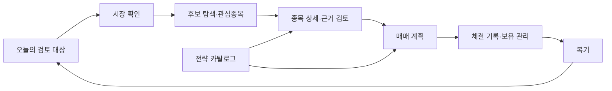
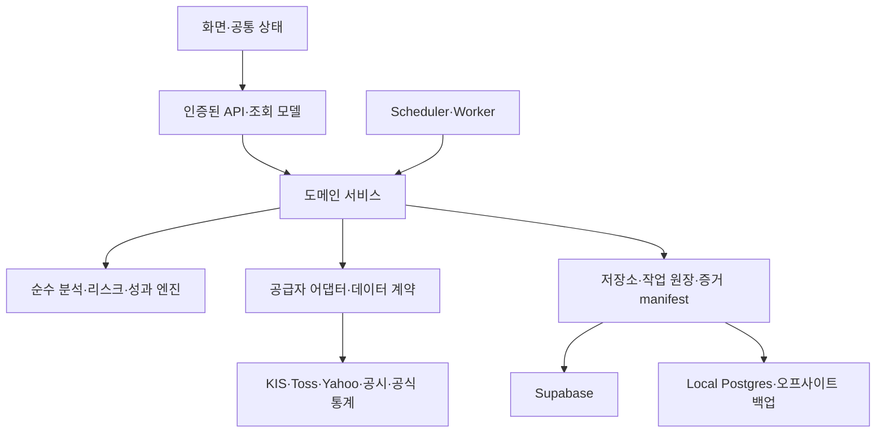

# MTN 전면 리뉴얼 계획

작성일: 2026-09-05 · 검토 기준: 로컬 `1b29470a0464b6b17d024f3faf37d7b443ec934c`

**권고: 분석·리스크·성과 검증 자산을 보존하고, 사용자 작업 흐름·데이터 계약·작업 실행 경계를 단계적으로 재구성한다.** 첫 2주에는 재현성·시장 맥락·복구 기반을 정비하고, 이후 종목 상세를 중심으로 발굴부터 복기까지 연결한다.

이 문서는 구현 전 계획이다. 현재 프로그램의 코드·DB·운영 설정 변경이나 배포를 포함하지 않는다. 확인 사실, 재현 결과, 미검증 가설은 [검토 근거 문서](/Users/mantori/vibecoding/MTN/docs/MTN_RENEWAL_REVIEW_2026-09-05.md)에 구분했다.

검증 종료 후 별도 작업의 종가베팅 전략(`/strategies/kr-closing-bet`) 변경이 작업 폴더에 추가됐다. 아래 규모·검증 결과는 위 기준 커밋에 대한 것이며, 진행 중인 신규 전략의 품질을 보증하지 않는다. 신규 전략도 운용의 전략 카탈로그와 공통 데이터·근거 계약에 연결하고, 1주 차 기준선 갱신 때 포함한다.

## 1. 목표와 범위

기본 사용자는 한국·미국 시장을 함께 검토하는 개인 투자자다. 기존 README의 목적에 따라 MTN을 종목 선별·투자 계획·매매 기록 도구로 유지한다. 예산은 기존 인프라를 활용하는 것을 기본으로 하고, 유료 데이터·인프라 도입은 필요성과 비용을 측정한 뒤 결정한다.

사용자가 매일 답해야 할 질문을 제품의 중심에 둔다.

1. 오늘 선택한 시장과 계좌에서 무엇을 검토해야 하는가?
2. 이 종목이 후보가 된 근거는 무엇이며, 데이터는 언제 관측되었는가?
3. 진입·무효화 조건과 허용 손실을 반영한 계획은 무엇인가?
4. 계획과 실제 체결이 어떻게 달랐고, 다음 판단에서 무엇을 고쳐야 하는가?

리뉴얼 범위는 전체 정보구조·공통 디자인, 핵심 화면, API와 데이터 계약, 분석·연구 재현성, worker와 배포·복구 절차다. 자동 주문, 다중 사용자 서비스, 구독·결제, 새 투자 전략 추가는 이번 완료 조건에 넣지 않는다. 다중 사용자 서비스가 목표로 바뀌면 인증·계좌 소유권·행 단위 권한 설계를 먼저 다시 산정해야 한다.

## 2. 현재 상태에 대한 판단

| 영역 | 현재 확인 | 리뉴얼 판단 |
|---|---|---|
| 규모 | 페이지 파일 33개, API route 108개, 단위 테스트 파일 175개, E2E spec 37개, Supabase migration 89개 | 기능을 추가하기 전에 사용 흐름과 책임 경계를 정리할 규모다. redirect 페이지도 집계에 포함된다. |
| 기술 기반 | Next.js 16.2.10, React 19.2.4, TypeScript, Supabase, Local Postgres | 기존 기반을 유지하고 구조를 개선한다. 프레임워크 교체는 현재 문제의 직접 해결책으로 선정하지 않는다. |
| 품질 기준선 | lint·typecheck·175개 단위 테스트 파일·API 인증 정적 검사·로컬 release preflight·production build 통과 | 재사용 가능한 회귀 기준이 있다. 테스트 수나 PASS를 투자 결과의 정확성으로 해석하지 않는다. |
| 사용자 흐름 | 접근성·워크플로우·전략 메뉴 관련 선택 E2E 32개 통과 | 외부 응답을 모킹한 Chromium/dev 검증이다. KR 전체 여정·실제 DB 계약·운영 성능은 별도 검증이 필요하다. |
| 제품 연결 | 시장 상태가 화면별로 분리되고, 종목 상세가 관심등록·계획으로 이어지지 않음 | 공통 시장·종목·계좌 맥락과 종목 상세를 먼저 연결한다. |
| 분석 정확성 | 후보 순서/중복에 따른 순위 변화 재현, 연구용 월간 백테스트의 비중 드리프트 문제 재현 | 계산 정책 버전과 비교 기준을 고정한 뒤 수정한다. 기존 발표 결과를 새 계산으로 덮어쓰지 않는다. |
| 운영 | 운영 인증 응답 정상, 로컬 3000 서버의 두 endpoint는 500. 로컬 HEAD와 배포 SHA가 다름 | 환경별 상태를 분리한다. 로컬 장애 원인과 배포 차이의 의도를 기준선 단계에서 확정한다. |

주요 소스와 실행 스크립트는 약 95,130줄이다. 일일 스캐너 1,451줄, 금 대시보드 1,460줄, CAN SLIM 화면 1,327줄처럼 큰 파일이 있으나 줄 수 자체가 결함은 아니다. 조회·계산·저장·표현이 함께 바뀌는 부분을 분리 대상으로 삼는다.

## 3. 유지·통합·교체 결정

| 결정 | 대상 | 실행 원칙 |
|---|---|---|
| 유지 | 기술 분석 엔진, 리스크 gate·포지션 크기 계산, 자본 검증, 체결·복기 기록 | 동일 입력 결과를 보존하는 회귀 검증 후 연결한다. 결함 수정은 정책 버전을 구분한다. |
| 유지·확장 | 추천 근거 manifest/hash, D5/D20/D60 성과, 비용 모델, 공식/폴백 표본 분리, cohort 검증 | 이미 있는 기능을 전략·연구 결과까지 확장한다. 새로 구축하는 것으로 산정하지 않는다. |
| 유지·보강 | Supabase scheduler 원장·slot claim, DB 작업 큐, 알림 receipt, CI, Supabase 백업 | 작업 완료 소유권·멱등성·전체 복구 절차를 보완한다. |
| 통합 | 시장·종목·계좌 상태, 데이터 신뢰도, 오류/빈 결과 표현, 스캐너 진입점 | 사용자에게 같은 데이터와 같은 상황이 같은 의미로 보이게 한다. |
| 재구성 | Stock360, 후보→계획→보유→복기 연결, desktop/mobile 탐색, 큰 화면의 통신·표현 결합 | 공통 작업 흐름을 먼저 구현하고 화면을 차례로 전환한다. |
| 점진 교체 | `lib`에서 API route를 호출하는 구조, 모호한 Supabase fallback, worker 완료 저장 조건 | 기존 API shape·레코드 ID를 유지하는 어댑터를 둔다. |
| 검증 후 정리 | 구형 화면·중복 표시·미사용 코드 | 사용처·기존 링크·운영 주기·복귀 검증 후 별도 정리한다. migration 이력은 보존한다. |

## 4. 새 정보구조와 화면별 설계

최상위 탐색은 **오늘 · 시장 · 종목 · 운용 · 복기**의 5개를 제안한다. 운영·가이드·자료는 보조 메뉴로 둔다. 메뉴 수와 이름은 첫 단계의 실제 작업 관찰로 확정할 설계안이다. 투자전략은 운용 안에 두되 즐겨찾기로 바로 접근할 수 있게 한다.

| 작업 공간 | 보존할 기능과 추가할 연결 | 첫 화면과 주요 행동 |
|---|---|---|
| 오늘 | Command Center를 유지하고 알림·검토 대상·미완성 계획·미작성 복기를 새 작업함으로 집계 | 선택 시장의 판단 요약, 처리할 일 3~5개, 보유 위험. 각 항목을 해당 종목·계획·거래로 연결한다. |
| 시장 | Master Filter, Macro, Risk Barometer, Intelligence | 시장 결론→근거→상세 순서. 시장 위험과 데이터 부족을 별도 표시한다. |
| 종목 | 6종 스캐너, 교차 확인, 콘테스트, 관심종목, Stock360 | 전략 프리셋으로 후보 탐색→비교→종목 상세→관심등록/계획. 콘테스트는 필요한 후보에 실행하는 심층 검토로 둔다. |
| 운용 | 계획, 포트폴리오, 체결·변경 기록, 6개 투자전략 | 계획 대기·보유·전략 탭. 계획은 실제 체결과 분리하고 계좌·통화·자본 기준을 명확히 표시한다. |
| 복기 | 거래 복기·통계, 추천 이력·성과·진단 | 실제 매매 성과와 추천 신호 성과를 각각 표시하고 원본 거래/근거로 이동한다. |
| 운영 | admin, local-analysis, 데이터 건강, 작업·백업 상태 | 늦은 작업·누락 데이터·실패 원인·복구 행동을 우선 표시한다. |

종목 상세는 공통 허브로 재설계한다. 상단에는 종목명·티커·거래소·통화·관측 시각, 바로 아래에는 후보 근거·반대 근거·무효화 조건을 둔다. 차트, 재무/공시, 수급, 분석 이력은 탭으로 제공한다. 관심등록·후보 비교·계획 작성은 항상 접근할 수 있게 한다. 계획 작성 시 근거 ID와 데이터 기준시각을 전달한다.

화면 공통 규칙은 다음과 같다.

- 시장·종목·계좌·필터를 URL과 공유 상태 계약으로 유지한다. 새로고침·뒤로가기·직접 링크에서도 같은 맥락이어야 한다.
- 일반 본문·핵심 표 숫자는 14px 이상을 출발점으로 검증한다. 금액은 통화와 단위를 표시하고 숫자를 정렬한다. 색과 작은 배지만으로 상태를 전달하지 않는다.
- 정상 로딩, 실제 지연, 빈 결과, 오류, 오래된 결과를 구분한다. 동일 시장·계좌·종목의 재시도에 한해 마지막 정상 결과와 기준시각을 보존한다. 맥락 변경 시 이전 결과를 새 대상의 결과처럼 표시하지 않는다.
- 전문 용어는 짧은 한국어 행동 설명과 함께 제공하고 계산식·운영 증거는 필요할 때 펼친다.
- 모바일 검색과 필터를 제공하고 표는 핵심 열/카드/상세보기로 대응한다. 360px, 200% 확대, 키보드 조작을 완료 조건에 둔다.
- 정상 지연 시세에 고정 `Live`를 붙이거나, 관측 시각이 없는 값을 “신뢰 가능”으로 표시하지 않는다.

## 5. 목표 구조와 데이터 계약

단일 저장소 안에서 도메인 경계를 정리한다. 웹과 비동기 worker는 실행 단위로 분리하되 동일한 서비스·순수 엔진을 호출한다. Supabase는 운영 상태·거래·요약의 기준 저장소, Local Postgres는 상세 분석 증거 저장소라는 현재 역할을 명시하고 복구 수준을 맞춘다.

| 경계 | 책임 | 완료 조건 |
|---|---|---|
| 데이터 | 종목 식별, 시세/재무/공시, 거래일, 기업행동, 공급자·유니버스 | 가격 숫자만 반환하는 경로를 줄이고 필수 메타를 끝까지 전달한다. |
| 분석·정책 | 점수·후보 집계, 차트 gate, 배분, 전략 상태 | 네트워크·DB·API route 없이 같은 스냅샷에 같은 결과를 낸다. |
| 결정·거래 | 검토·계획·체결·변경·복기 | 원천 근거와 자본/리스크 스냅샷을 추적하며 실제 체결을 계획으로 대체하지 않는다. |
| 근거·성과 | 버전, 입력 hash, benchmark·비용·결과 | 과거 발표 결과를 유지하면서 새 정책 결과와 비교한다. |
| 작업·운영 | 수집/분석/발행/성과 작업, lease, 재시도, 상태 조회 | 재시작·소유권 상실·부분 저장 실패를 일관되게 처리한다. |

기존 `DataSourceMeta`, `apiSuccess/apiError`, 추천 manifest를 확장하는 방식으로 시작한다. 아래는 신규 제품 전체에 강제할 완성 스키마가 아니라 첫 단계에서 확정할 계약 항목이다.

| 계약 | 필수 의미 |
|---|---|
| Instrument | 불변 종목 ID, 티커, 거래소, 시장, 통화, 시간대, 유니버스 버전 |
| Observation | 값·단위, 원천 관측 시각, 수집 시각, 계산 시각, 거래일, 공급자, raw/adjusted 구분 |
| Quality | 신선도, coverage, 폴백 여부·이유, 누락 사유, 실제 데이터 지연, 사용 가능 범위 |
| DecisionContext | 선택 시장·종목·계좌, 근거 ID, 자본 스냅샷, 정책/모델 버전, 결정 시점 |
| Evidence | 입력/출력 hash, 원천 참조, 실행 ID, benchmark·비용·기업행동 정책, 연구/운영 상태 |
| Job | 유형, 입력 hash, idempotency key, worker/attempt/lease token, 단계, 다음 재시도 시각, 결과 참조 |

신선도·원천 신뢰도·데이터 완전성·모델 승인 상태는 서로 다른 축으로 보존한다. 화면에서는 요약할 수 있으나 저장 계약에서 하나의 “정상” 값으로 합치지 않는다. KR 벤치마크는 공식 지수와 ETF 대체 자료의 의미를 먼저 확정한다. 공식 표본 수를 채우기 위해 대체 자료를 임의로 공식으로 승격하지 않는다.

성능은 초기 응답과 상호작용이 필요한 범위를 구분하고 서버 조회·캐시·스트리밍·지연 로딩을 측정 후 적용한다. 이는 현재 구조를 유지하며 개선하는 방향으로, Next.js의 공식 [운영 체크리스트](https://nextjs.org/docs/app/guides/production-checklist)에서 제시하는 검증 항목과 맞춘다.

## 6. 실행 로드맵

기간은 **전담 개발자 1명과 AI 보조, 기존 인프라 유지, 주중 검증 가능**을 가정한 10~12주 추정이다. 요구사항·운영 데이터 상태·사용자 검토 시간에 따라 달라진다. 1주 차에 실제 작업량으로 다시 산정한다. 2명이 UI와 데이터/운영을 병렬 수행하면 구현 시간을 줄일 수 있으나 시장 관찰 기간은 유지한다.

| 단계 | 예상 시점 | 병렬 작업과 산출물 | 다음 단계 진입 조건 |
|---|---|---|---|
| 0. 기준선 | 1주 차 | 사용자 일과 관찰·현재 기능 지도 / 운영 SHA·환경·작업 목록 / 데이터·API 계약과 결함 재현 | 로컬 500 원인 분류, 지원 Node 재현, 실제 작업/백업 위치 확인, 기준 스냅샷 확보 |
| 1. 공통 기반 | 2~3주 차 | 시장·계좌·종목 계약 및 UI 상태 체계 / 공급자 메타·순위 정책 수정 / 백업·worker 소유권·단일 관리자 인증 보강 | UI 후속 작업은 공통 계약과 맥락 테스트 통과 후 진행. 순위 전환에는 순열·중복 검증, 쓰기/worker 전환에는 복원·소유권 검증 필요 |
| 2. 후보→계획 | 4~5주 차 | 새 탐색·오늘/시장 화면 / 종목 허브·스캐너 통합 / API·서비스 경계 분리 | 후보→상세→관심등록→계획에 근거·시장·자본 유지, 구형 링크 호환 |
| 3. 운용→복기 | 6~7주 차 | 계획·보유·체결·복기 통합 / 추천·실거래 성과 분리 / 전략 공통 화면·연구 회계 검증 | 실제 수량·현금·비용·변경 이력 보존, 연구 결과 재현, 통화 혼합 방지 |
| 4. 운영·전환 준비 | 8~9주 차 | 운영 화면·릴리스/rollback 절차 / production E2E·성능·접근성 / 신규·기존 결과 차이 분석 | 복귀 실습, 핵심 흐름 통과, 지연·오류·복구 행동 확인, 미해결 중대 결함 없음 |
| 5. 운영 확인·완료 | 10~12주 차 | 기능별 사용자 전환→작업 실행권 전환→관찰→구형 경로 정리 제안 | 아래 운영 관찰·무결성·사용성 기준 충족 및 사용자 수용 |

의존성은 **기준선 → 공통 계약 → 핵심 흐름 → 운영 전환**이다. 공통 계약이 정해지면 UI·데이터 엔진·복구 정비는 병렬 진행할 수 있다. UI 시제품과 읽기 흐름을 복구 작업 완료까지 일괄 대기시키지 않는다.

5주 차부터 준비된 분석 기능을 비교 모드로 운영한다. 운영 거래·추천 원장 변경과 외부 발송 없이 격리된 비교 증거만 저장한다. 계산 기능별 최종 정책 버전을 기준으로 전환 전 최소 20거래일의 결과 차이를 검토한다. 비교 시작일과 마지막 중대한 정책 변경일을 기록하고 변경 시 필요한 관찰 기간을 다시 산정한다. 월간 작업은 최소 1회 실제 예약 실행과 2개 과거 월말 재생 검증을 포함한다. 거래일 수나 성과 표본이 부족하면 해당 전략의 승인 상태를 유지하고 관찰 기간을 연장하며, 이 경우 10~12주 추정을 초과할 수 있다.

## 7. 첫 2주에 착수할 작업

P0는 해당 기능의 운영 전환에 필요한 최우선 조건, P1은 1차 사용자 전환 조건, P2는 후속 통합 범위다. P0가 모두 끝나야 독립적인 설계·시제품 작업을 시작할 수 있다는 뜻은 아니다. 현재 운영 사고가 확인되었다는 의미로 사용하지 않는다.

| ID | 우선순위 | 작업 | 검증 가능한 산출물 |
|---|---|---|---|
| R01 | P0 | 실행·배포 기준선 고정 | Node 명세, 로컬 500 원인과 재현/해소 기록, 웹·worker·DB·scheduler 버전 목록 |
| R02 | P0 | 로컬 증거 복구 설계·검증 | 백업 위치/키/보존 정책, 암호화 오프사이트 사본, 새 DB 복원 및 참조 일치 기록 |
| R03 | P0 | 순위 집계 재현성 확보 | 동일 후보 순열·중복 입력의 동등 결과, tie-break 명세, 새 정책 버전과 과거 비교 |
| R04 | P1 | 공통 시장 맥락 연결 | KR 후보→KR 계획→KR 보유, US 대응 흐름, 새로고침/뒤로가기 테스트 |
| R05 | P1 | UI 상태·신뢰도 계약 정리 | 정상 로딩에서 오류 미표시, 지연/빈 결과/장애 구분, 미관측 데이터 신뢰 배지 차단 |
| R06 | P1 | 작업 완료 소유권·멱등성 | 이전 worker 늦은 완료 거부, 같은 job 재시도 중복 증거/중복 발송 방지 |
| R07 | P1 | 종목 허브·탐색 프로토타입 | 대표 US/KR 후보로 상세→관심→계획 완주, 모바일 검색과 접근 가능한 CTA |
| R08 | P1 | 연구 회계·KR benchmark 정책 | 백테스트 1.0/1.125 재현의 회귀 기준, 실제 비중 드리프트·거래비용 계약, 공식/대체 자료 사용 규칙 |
| R09 | P1 | 단일 관리자 인증 보강 | production 인증 비활성화 차단, 공유 로그인 제한·세션 폐기/키 순환 정책, 보호 API별 미인증·잘못된 자격증명·권한 경계 실행 검증 |

첫 2주의 현실적인 완료 목표는 R01·R03·R04·R05다. R02는 복원 기반 확보까지, R06~R09는 계약·재현·설계까지 착수하고 3주 차 이후 구현·검증을 마무리한다. 기존 순위 결과의 영향 범위가 크면 UI 확대보다 해당 정책 검증에 우선 배정한다.

## 8. 성공 지표와 완료 기준

아래 수치는 현재 성능 측정값이 아닌 제안 목표다. 1주 차에 현재값과 측정 조건을 기록하고 확정한다. 투자 수익률 향상을 리뉴얼 완료 기준으로 약속하지 않는다.

| 영역 | 측정 방법과 제안 목표 |
|---|---|
| 일상 사용 | 같은 대표 업무 5개를 관찰해 중간값 완료시간을 기준선 대비 30% 줄인다. 오늘의 검토 대상은 첫 화면에서 확인한다. |
| 핵심 흐름 | US/KR × desktop/360px에서 후보→계획→체결 기록→보유→복기 시나리오 100% 통과. 시장·통화·계좌·근거 누락 0건. |
| 데이터 | 신규 계약 적용 endpoint의 메타 누락 0건. 오래됨/폴백/부분 실패가 정상 데이터와 구분된다. 휴장·시차 기준 포함. |
| 계산 | 순열·중복 불변성, 결정적 tie-break, 거래 없는 기간 자산 보존, 실제 거래 비용, 분할·배당·결측·과거 시점 데이터 검증 통과. |
| 성과 | 추천 신호와 실제 매매를 분리하고 비용·benchmark·평가일·근거 등급을 추적한다. 기존 공식/폴백·승격 gate 유지. |
| 작업 | lease 상실·중간 네트워크 실패·프로세스 재시작 주입 실험에서 중복 발행/발송 0건. 불일치 결과는 자동 재조정 또는 운영 조치로 노출. |
| 접근성 | 핵심 5개 작업 공간+종목 상세+계획에서 serious/critical 자동 위반 0건, 키보드 초점·200% 확대·360px 검증 통과. 자동검사 외 수동 검토 포함. |
| 인증 | production 인증 비활성화 거부, 보호 endpoint별 미인증 접근 차단, 세션 폐기·로그인 제한·키 순환 검증. 정적 auth 검사와 실행 검증 모두 통과. |
| 성능 | production build에서 LCP 2.5초 이하·INP 200ms 이하·CLS 0.1 이하를 목표로 한다. 충분한 실제 표본이 있으면 기기별 75백분위로 측정하고, 소수 사용자 환경은 고정 기기/네트워크의 반복 실험을 별도로 기록한다. 기준: [Web Vitals](https://web.dev/articles/vitals?hl=en). |
| 복구 | 제안 RPO: 거래·설정 12시간 이내, 로컬 증거 24시간 이내. 제안 RTO: 핵심 조회 4시간 이내. 최근 실제 복원 가능 시점의 나이를 측정하고 목표 초과 전 경보·실패 시 보완 실행을 검증한다. 예약 횟수만으로 충족 판정하지 않는다. 발송 서비스 재개는 별도 검증한다. |
| 배포 | 배포된 웹·worker·migration·scheduler의 버전/설정 지문 확인. 단일 writer와 알림 원장 보존, 이전 릴리스 복귀 실습 통과. |

RPO는 허용 가능한 데이터 손실 시간, RTO는 서비스 복구 목표 시간이다. 거래 기록의 손실 허용치가 더 짧아야 한다면 백업 빈도·내보내기·관리형 복구의 비용을 재산정한다. 기존 Supabase 백업은 보존하고 로컬 증거까지 복원 가능 범위를 확장한다. 오프사이트 보관과 복원 검증은 Supabase의 공식 [백업 안내](https://supabase.com/docs/guides/platform/backups)와 함께 점검한다.

## 9. 데이터 전환과 rollback

1. **기준선 보존:** 현재 추천·근거·거래·실행 원장의 ID/FK와 정책 버전을 기록한다. 민감 데이터가 없는 대표 검증 스냅샷을 만든다.
2. **호환 확장:** 새 컬럼/테이블/메타는 추가 방식으로 도입한다. 구형 응답은 어댑터로 유지하고 기존 migration을 재번호화하지 않는다.
3. **비교 운영:** 같은 입력으로 기존·신규 결과를 계산하되 발행과 외부 발송은 기존 한 경로만 담당한다. 의도된 정책 차이는 버전과 이유를 기록한다.
4. **기능별 읽기 전환:** 오늘/시장→종목→계획/보유→복기/전략 순으로 전환한다. 기존 URL의 query·종목·시장 맥락을 보존한다.
5. **실행권 전환:** 전환·복귀 대상 worker 모두에 완료/발행 시 소유권 검증을 먼저 배포한다. 이전 worker 신규 claim 중단→진행 작업 종료 또는 확실한 중단 확인→신규 worker claim 허용 순으로 전환한다. lease 만료만으로 이전 실행이 멈췄다고 판단하지 않는다.
6. **복귀:** 화면/API flag 복귀→신규 worker claim 중단→진행 작업 중단·원장·소유권 확인→소유권 보강을 포함한 이전 호환 worker 재개. DB를 삭제·역변환하는 rollback 대신 이전 코드가 읽을 수 있는 스키마를 유지한다.
7. **정리 검토:** 최소 운영 관찰 조건과 복귀 실습 후 구형 화면/route 정리를 별도 변경으로 검토한다. 거래·추천 근거·알림 receipt는 그대로 보존한다.

정책 계산 불일치가 설명되지 않거나, 잘못된 시장/통화, 근거 참조 유실, 중복 발송, 현재 소유자가 아닌 worker의 결과 발행이 발생하면 해당 기능 전환을 중단하고 직전 읽기/실행 경로로 복귀한다.

## 10. 완료 시 인수할 산출물

- 현재/신규 기능 지도, 화면별 사용자 작업과 이전 URL 연결표
- 공통 디자인·검색·상태 표현과 시장/계좌/종목 계약
- 데이터 카탈로그·API 계약·정책/모델 버전·재현 가능한 평가 기록
- 작업 목록·lease/재시도 정책·운영 화면·장애 대응 절차
- production 검증 결과, 백업 복원·릴리스·rollback 실습 기록
- 단일 README 시작 절차와 최신 운영 문서, 실제 사용자 수용 결과

착수 후 먼저 확정할 사업상 가정은 주 사용 기기, 매일 수행하는 작업 5개, 계좌 수, 허용 운영비, 손실 허용 시간이다. 이 확인 전에도 R01·R03·R05와 데이터 계약 목록화는 독립적으로 시작할 수 있다.
