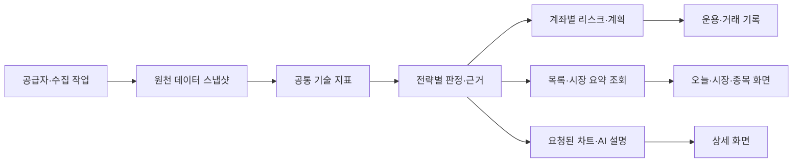

# MTN UI·성능·기능 통합 설계안

작성일: 2026-09-05 · 개정 5: 2026-09-09 중복 화면·불필요 요소 정리 계획 추가 · 구현 전 제안

2026-09-09 로그인된 운영 화면을 확인하여 초기 전환안을 수정했다. **현재 다크 테마·상단 가로 탐색·스캐너 전문 표·큰 차트를 유지한다.** 좌측 5개 메뉴로 즉시 바꾸는 이전 시안은 폐기한다. 화면별 확인 사실과 이번 이미지 시안의 범위는 [실제 UI 기반 수정안](/Users/mantori/vibecoding/MTN/docs/MTN_UI_REALISTIC_REVISION_2026-09-09.md)이 우선한다.

후속 요청에 따른 **중복 화면·탭·입력·백그라운드 조회의 정리 결정은 8절**에서 관리한다. 기존 가로 탐색을 유지하는 원칙 안에서 실제로 겹치는 요소를 먼저 줄인다. 8절의 D01~D11은 기존 UP 작업의 구체화이며 별도 중복 개발 범위가 아니다.

[전체 리뉴얼 계획](/Users/mantori/vibecoding/MTN/docs/MTN_RENEWAL_PLAN_2026-09-05.md)은 일정·전환·인수 기준을, 이 문서는 화면 배치·기능 소유권·성능 설계를 관리한다. 현재 소스의 정적 근거와 검증 한계는 [검토 근거 8절](/Users/mantori/vibecoding/MTN/docs/MTN_RENEWAL_REVIEW_2026-09-05.md)에 둔다. 아래 응답시간·절감률은 실측 성과가 아닌 착수 시 검증할 목표다.

## 1. 권장안과 선택 이유

**기존 탐색과 전문 화면 유지 + 작업별 대표 편집기 + 공유 데이터·계산 + 가벼운 조회 화면**을 권장한다. 사용자는 오늘 할 일을 찾고, 같은 종목·계좌·근거를 유지한 채 검토→계획→체결→복기로 진행한다. 동일한 입력·시점·정책의 수집과 계산은 재사용한다. 아래 5개 공간은 기능 소유권을 설명하는 논리적 분류이며, 즉시 적용할 메뉴 개수나 좌측 메뉴의 근거가 아니다.

| 대안 | 판단 |
|---|---|
| 기존 모든 페이지의 외형만 통일 | 화면 간 반복 조작·중복 요청·기록 연결 문제가 남으므로 부분 개선 수단으로 사용 |
| 모든 기능을 한 대시보드에 배치 | 첫 화면의 정보량·조회·렌더링 부하가 커지므로 채택하지 않음 |
| 기존 탐색을 유지하고 필요한 목록·상세만 열기 | **1차 권장.** 작업 맥락과 전문 지표를 보존하면서 중복 조작·조회부터 제거. 5개 메뉴 통합은 사용성 비교 후 별도 결정 |
| 프레임워크 교체·마이크로서비스·새 캐시 인프라 | 기존 Next.js·Supabase·Local Postgres로 해결 가능한 중복을 먼저 제거. 계측 후 병목이 남을 때 재평가 |

‘중복 없음’은 메뉴 이름을 줄이거나 서로 다른 전략을 하나로 합친다는 뜻이 아니다. 대표 소유권 밖의 독립 편집기, 같은 입력의 반복 실행, 같은 레코드의 중복 등록·발송을 제거한다. 과거 판단 재현을 위한 불변 스냅샷과 의도된 캐시 사본은 보존한다.

## 2. 최적 UI의 배치와 행동

데스크톱은 현재의 다크 테마, MTN 로고·검색·5개 시장 지표, 가로 8개 메뉴와 투자 전략 진입점을 유지한다. 스캐너의 두 번째 탐색 줄은 6개 엔진 선택이므로 상위 메뉴와 중복으로 취급하지 않는다. 큰 설명·설정 카드를 작은 도구 모음으로 정리하고 결과표의 첫 노출을 앞당긴다. 현재 운영에서 확인하지 않은 계좌 선택기를 새로 추가하지 않는다. 모바일은 기존 탐색을 기준으로 핵심 과제를 검증한 후 개선하며, 데스크톱 시안만으로 5개 하단 메뉴를 확정하지 않는다.

| 공간 | 첫 화면의 정보 순서 | 주요 행동·상세 공개 |
|---|---|---|
| 오늘 | 현재 Command Center의 시장 선택 → 다음에 할 일·오늘 요약 → 관심 후보·최근 매매 | 실제 존재하는 검토 대상을 담당 화면으로 연결. 신규 작업함은 데이터 연결 이후 확장하며 빈 기록을 가상 작업으로 채우지 않음. 전체 차트·스캐너 미로딩 |
| 시장 | 결론·관측시각·품질 → 달라진 근거 → 요약/내부 건강/거시/과열/이벤트 | 상태에 맞게 ‘후보 검토’ 또는 ‘보유 위험 점검’. 계산식·원천·긴 차트는 펼침/상세 탭 |
| 종목 | 검색·저장된 보기·기존 6개 엔진 탭 → 엔진별 전문 표/카드 → 선택 종목 상세 | 목록 ‘콘테스트로 이동’, 상세 ‘계획 작성’. 표는 전체 폭을 유지하고 차트는 큰 모달/상세로 제공. 분할 보기는 열·차트 가독성이 확보될 때 선택형으로 검증. 필터·선택·스크롤 복구 |
| 운용 | 계획 대기/보유/전략 → 선택 항목 → 조건·금액·리스크 → 확인 | 계획 ‘계획 저장’, 보유 ‘체결 기록’. 7개 전략은 같은 진입점·공통 틀 안에서 고유 조건 제공 |
| 복기 | 미작성 복기 → 실제 매매/추천 신호/전략 가상 평가 → 근거·통계 | ‘복기 작성’ 또는 ‘발표 당시 근거’. 수익률·원장·평가 정책은 유형별로 구분. 긴 이력·차트는 후속 조회 |

종목 상세는 **종목·시장·통화·분석 기준시각 → 핵심 지표와 MTN Pro 큰 패턴 차트 → 조건별 근거·무효화 → 계획 행동**을 기본으로 검증한다. 차트 보기로 진입한 경우 차트를 바로 노출하며 긴 설명 뒤에 숨기지 않는다. MTN Pro/TradingView/Naver, 기간·이평선·거래량·피벗 표시를 보존한다. 쿨라매기의 snapshotId 기반 셋업 근거와 최신 Stock360 분석은 별도 맥락을 유지한다. 거래 상세는 그 거래의 계획·체결·수정·복기를 소유한다.

공통 UI 계약은 다음과 같다.

- URL은 공유할 수 있는 시장·종목·프리셋·필터·탭·원본 snapshot을 담는다. 계좌 식별은 불투명 ID와 서버 권한 검사로 연결하고 잔액·자본·개인 메모는 URL에 넣지 않는다. 편집 중 초안은 별도 상태로 보존한다.
- 선택 상태 Context와 무거운 시장 데이터 조회를 분리한다. 현재 MarketProvider의 조회를 모든 화면에 확장하지 않는다. 서버 초기값·클라이언트 이동·뒤로가기의 같은 key 계약을 사용한다.
- 전역 검색은 한 구현을 데스크톱·모바일에서 공유한다. 종목명/티커/시장 구분, 키보드 선택·닫기, 오류·빈 결과를 제공한다. 페이지 필터는 해당 목록에만 적용한다.
- 기본 본문·핵심 수치 14~16px, 숫자·통화 정렬, 클릭 영역 44px을 출발점으로 한다. 고밀도 보기는 간격·보조 열을 줄이고 글자를 과도하게 축소하지 않는다. 명암 대비·키보드 초점·200% 확대·320/360px 재배치를 검증한다.
- 로딩/지연/빈 결과/부분 자료/오류/오래됨을 공통 상태 컴포넌트로 표현한다. 이전 시장의 늦은 응답을 새 시장 아래 표시하지 않는다. 위험·철회·만료는 색과 함께 문장으로 표시한다.
- 화면별 현재 작업의 주요 동사는 하나로 정한다. 저장은 중복 클릭에 안전해야 하며 입력값과 오류 위치를 보존한다. 데이터 부족·만료 상태에서는 자료 확인·원본 조회가 주요 행동이다.
- 공통 목록은 선택·필터·정렬·저장된 보기·로딩 구현을 공유하고 열 구성은 엔진별로 유지한다. 미너비니의 시총·현재가·등락률·ADR·SEPA·RS·VCP·거래량·피벗·등급·패턴·차트/후보 선택을 단순 이름/근거 열로 대체하지 않는다. 대량 기록은 페이지 단위 조회를 먼저 검토하고 가상 스크롤은 렌더링 병목이 입증될 때 도입한다.

### 종가베팅 전용 UI

운영에서 확인한 코스피/코스닥 Top5의 두 열, 실전 스냅샷/과거 재현·검토, 기준일·새로고침을 유지한다. 제목·설명을 압축하고 추천 후보/익일 시초 성과를 로컬 탭으로 나누되 후보 화면에도 성과 요약 연결을 남긴다. 선정 0개일 때 반복되는 미선정 5행은 하나의 빈 상태로 줄이고 시장 상태·수집률·보류 사유·기준시각·확인 사항은 남긴다.

2026-09-09 운영에서 확인한 익일 시초 성과는 **추천일 KRX 종가 매수 가정 → 다음 거래일 NXT 08:05 및 KRX 09:05로 표시된 각 1분봉 종가 매도 가정**, 왕복 비용 25bp다. NXT 미거래·분봉 누락은 미확인이다. 9월 5일 로컬 검토의 개장 +30분 조건부 평가와 서로 다른 정책이므로 통합 수익률로 섞거나 하나를 삭제하지 않는다. 이번에는 화면의 설명을 확인했으며 새 평가 구현·정확성·배포 버전 검증은 별도다.

한국 전용 전략임을 명시한다. 일반 시장 선택을 미국으로 바꾸었다고 미국 종가 전략처럼 표시하지 않는다. 세션 날짜·원천 기준시각·모델 상태·유효기간을 상단에서 확인할 수 있게 한다. 화면의 WATCH→FINAL 전환과 철회·만료는 열린 상태에서도 갱신한다.

| 현재 상태 | 우선 표시 | 주요 행동 |
|---|---|---|
| 준비/관찰 | 기본 수집과 상세 수집 완료율, 다음 단계·예정 시각 | ‘관찰 근거 보기’ |
| LIVE FINAL·진입 유효 | 발행 당시 기준과 현재 유효성, 만료 시각, 진입 범위·무효화 | ‘계획 검토’. 저장 직전에 서버가 현재 유효성 재검증 |
| 보류/철회/만료 | 사유와 효력 시각, 발행 원본 연결 | ‘변경 근거 확인’. 원본을 현재 진입 신호로 재사용하지 않음 |
| 과거 LIVE/REPLAY | 과거 기록 또는 재생 분석임을 명시, 당시 기준·평가 버전 | ‘당시 근거·가상 평가 보기’ |

발송 성공, 데이터 품질, 현재 진입 유효성, 전략 성과 검증은 별개다. 웹·알림·계획은 같은 snapshotId와 철회 이벤트를 참조한다. 알림 재전송이나 재계산을 브라우저 새로고침의 부수효과로 만들지 않는다.

## 3. 현재 34개 페이지의 기능 소유권

아래는 전환 후 목표이며 URL 변경을 지금 적용하지 않는다. 같은 대표 화면에 속해도 필요한 상세 경로는 유지한다. 새 화면의 동등 기능·권한·기존 query/원본 링크·복귀가 확인된 뒤 호환 redirect를 적용한다.

| 현재 경로 | 대표 공간·처리 | 보존할 차이 |
|---|---|---|
| `/` | 오늘의 작업함 | 기존 요약을 같은 객체의 조회로 제공 |
| `/master-filter`, `/macro`, `/market-barometer`, `/intelligence` | 시장의 요약/내부 건강/거시/과열/이벤트 뷰 | 각 판정과 이벤트 원장 유지. 미국 과열 지표의 범위 명시, 임의 단일 점수 합산 없음 |
| `/scanner`, `/canslim`, `/leader`, `/momentum`, `/qullamaggie`, `/reversal` | 기존 6개 탭·경로·전문 표/카드 유지, 공통 조작 셸 | 6개 엔진·유니버스·지표·점수 의미와 snapshot 근거 차트 유지. 실행·진행·필터·정렬·선택·관심등록은 공통 구현 |
| `/cross-check` | 종목 발굴의 ‘여러 스캐너 포착’ 통합 보기 | 현재 선택 엔진만의 필터가 아닌 6개 결과의 합집합에서 포착 집계. 기준시각·집계 규칙·누락 상태 보존, 독립된 검증으로 과장하지 않음. D02 전환 후 호환 경로 유지 |
| `/contest`, `/beauty-contest` | 종목의 선택 후보 비교·심층 검토 | 세션·후보풀 스냅샷·선택적 LLM 검토 유지. beauty-contest는 이미 redirect |
| `/watchlist` | 종목의 저장된 관심 보기 | 관심종목 저장소 유지, 논지·촉매·검토일 편집은 공통 종목 상세 |
| `/stock/[ticker]` | 종목 상세의 대표 경로 | 목록 모달·관심 분석·계획의 참고 분석이 같은 상세 조회/표현 사용 |
| `/plan`, `/portfolio` | 운용의 계획 편집기·보유 관리 | 계획·실제 체결·보유는 별도 객체. 전략 목표 배분을 실제 보유로 중복 저장하지 않음 |
| `/strategies/kospi-52w`, `/strategies/us-52w` | 운용의 국내/미국 52주 전략 | 기존 StrategyShell 보강, 시장별 유니버스·선정·대기 규칙 유지 |
| `/strategies/kospi-monthly`, `/strategies/us-monthly-v7` | 운용의 국내/미국 월간 전략 | 이미 공유하는 MonthlyStrategyPage 재사용. 신규 공통화 작업으로 중복 산정하지 않음 |
| `/gold`, `/nasdaq`, `/qqq` | 운용의 금·나스닥100 전략 | 고유 자산·배분·레버리지 정책 유지. qqq는 기존 redirect |
| `/strategies/kr-closing-bet` | 운용의 종가베팅 | 세션·WATCH/FINAL·LIVE/REPLAY·철회·만료·익일 평가 특화 유지 |
| `/history`, `/history/[tradeId]` | 복기의 실제 매매 목록/통계·거래 상세 | 같은 거래·체결·복기 원장. 조회 통계 때문에 새 거래 기록 생성하지 않음 |
| `/recommendations` 및 metrics/diagnostics query | 복기의 추천 신호 이력/성과/진단 | 발표 근거·평가 cohort 보존. 실제 매매 성과와 집계 분리 |
| `/admin`, `/admin/local-analysis` | 운영 보조 공간 | 권한·작업 원장·재시도 기능 보존 |
| `/guide`, `/links`, `/login` | 가이드·자료 보조 메뉴, 인증 진입 | 인증은 탐색 메뉴 밖에서 유지 |

공통화할 기능의 담당도 하나로 정한다. 탐색 정의는 하나의 registry, 종목 검색은 하나의 검색 컴포넌트/서비스, 관심등록·계획 저장·체결 기록·복기 저장은 객체별 하나의 도메인 명령을 사용한다. 여러 화면의 CTA는 이 명령/편집기를 여는 연결점이다. 스캐너와 전략의 공통 셸은 표현·상태만 공유하고 알고리즘은 전략별 모듈에 둔다.

## 4. 성능을 높이는 실행 구조

화면 합치기와 데이터 전체 합쳐 읽기를 구분한다. 첫 화면은 저장된 요약을 읽고, 필요한 상세만 후속 조회한다. 장기 분석·원천 보충·AI 설명은 작업으로 분리하되 자료가 없으면 실제 준비 상태와 진행 상황을 반환한다.

| 계층 | 적용할 최적화 | 확인할 결과 |
|---|---|---|
| 브라우저 조회 | 공통 query 계층이 key·in-flight·취소·재시도·무효화 소유. macro의 Provider/페이지/MarketStrip은 같은 결과 구독 | 같은 데이터 세대의 동시 요청 1회. CSS로 숨긴 메뉴/패널의 조회 0회 |
| 렌더링·번들 | 서버에서 초기 요약을 읽고 상호작용 범위만 Client Component로 유지. 차트·심층 비교·연구는 지연 import | 오늘 화면에서 차트 라이브러리·운영 분석 chunk 미요청. 차트 옵션 변경 시 instance 재생성 없이 갱신 |
| API 전송 | 목록·요약·상세 projection 분리, market-data의 최상위/data 중복 응답을 표준 `{data,meta}`로 전환 | 구형 소비자 어댑터 전환 후 중복 직렬화 제거. 압축 전/후 bytes·JSON 파싱 시간·메모리 각각 비교 |
| 거래·보유 조회 | 계좌/시장/status를 DB에서 필터, 필요한 열+cursor pagination, 요약은 서버 집계 | 전체 거래·전체 체결 다운로드 없이 오늘/복기 KPI 표시. 프로필 보충의 provider fan-out·DB 쓰기는 별도 작업 |
| 원천·공통 계산 | 종목·벤치마크 취득을 서비스로 모으고 같은 관측/필요 최대 구간을 공유. 공통 지표와 계좌 수량 계산 분리 | CANSLIM의 종목별 benchmark 반복 취득 제거. 자본·risk% 변경으로 OHLC·재무 재취득/공통 지표 재계산 없음 |
| 캐시 | 기존 L1/L2·singleflight를 필요한 경로에 일관 적용. 원 만료 보존, 범위 재사용, byte 기준 용량 제한 | L2→L1 승격이 만료를 연장하지 않음. 프로세스 내부 중복 miss 합침. 분산 조정은 측정상 필요한 경로에 한정 |
| AI·차트 | 분석 gate·규칙 계획·차트·AI가 analysisSnapshotId 공유. 규칙 결과 먼저, AI 설명은 필요할 때 비동기 생성 | 같은 분석/model/prompt hash의 중복 생성 0회. 순위·문구·언어 변경이 가격 취득/규칙 재실행을 강제하지 않음 |
| DB·증거 | 기존 인덱스와 batch 저장 활용, 실제 실행계획 확인 후 개선. 불변 증거의 공통 가격 조각은 절감량 입증 시에만 도입 | 평가 hash·과거 결과·정정 재현 보존, 데이터 순증량/읽은 행/I/O 기록 |

현재 KIS 캐시와 instance singleflight, 추천 성과의 종목별 묶음·benchmark cache, 일부 차트의 dynamic import는 이미 구현되어 있다. 이를 교체 대상으로 간주하지 않는다. 새 query 라이브러리는 필수 전제로 두지 않으며, 기존 공통 hook으로 소유권·취소·무효화 계약을 충족하는지 작은 범위에서 확인한 뒤 한 가지 구현만 선택한다.

서버 초기 조회는 공통 서비스를 직접 호출하고 API route를 HTTP로 다시 호출하지 않는다. 기존 일일 스캐너의 route 함수 직접 import도 같은 서비스 경계로 이전한다. 로딩 분리는 Next.js의 [Server/Client 구성 원칙](https://nextjs.org/docs/app/guides/production-checklist)과 [지연 로딩](https://nextjs.org/docs/app/guides/lazy-loading)을 기준으로 검증한다. DB는 운영 규모의 격리된 검증 데이터에서 `EXPLAIN (ANALYZE, BUFFERS)`로 읽은 행·정렬·I/O를 확인한다. ANALYZE는 쿼리를 실제 실행하므로 부수효과 없는 조회에 적용한다. [PostgreSQL 실행계획 안내](https://www.postgresql.org/docs/current/using-explain.html)

### 자동 갱신·마감 처리

- 활성 화면·관련 시장 세션·해당 데이터의 갱신 필요를 모두 만족할 때만 주기 조회한다. 장후 평가·철회·작업 상태는 시세와 별도 일정으로 갱신한다. 숨긴 탭은 자동 polling을 멈추고 복귀 시 필요하면 한 번 재검사한다. 사용자의 수동 재조회는 항상 명시적으로 처리한다.
- Intelligence의 이전 요청 취소, MarketStrip의 visibility/abort, Portfolio의 loading/failure 중 interval 중단은 보존하고 빠진 조건만 공통화한다. 시장 변경은 이전 응답의 반영을 차단한다. 지수형 backoff·jitter와 재시도 한도를 설정한다.
- 화면을 숨겨도 서버의 종가 발행·조건이탈 감시·익일 평가 작업은 계속한다. 모든 갱신을 브라우저 생명주기에 묶지 않는다.
- 공급자별 공유 용량에서 **당일 마감·조건이탈 → 사용자 조회·계획 → 일일 수집·평가 → backfill·AI 연구**의 우선순위를 둔다. 기존 worker/HTTP 작업은 각각 유지하되 같은 공급자 제한과 실행 원장을 공유한다. 마감 전 낮은 우선순위의 신규 수집을 제한하고 오래 대기한 일반 작업에는 점진적으로 우선순위를 높인다.
- 일반장/특별장 마감에서 역산해 필요한 기본·상세 요청 수, cache hit, queue wait, 재시도 예산으로 수용 가능 여부를 판정한다. 두 시장 동시 cold/warm, 다른 작업 동시 실행, KIS 지연/429, 공유 limiter 장애를 검증한다. 제한기 장애 시 각 인스턴스의 로컬 fallback이 총량을 넘기지 않게 critical 경로 보류 정책을 정한다.
- 처리량을 맞추려고 coverage·원천 시각·공식 후보 기준을 완화하지 않는다. 데이터 검증과 마감 내 처리가 불가능하면 보류/미발행 원인을 남긴다. LLM 동시 실행은 우선 1개를 유지하고 CPU·RSS·swap을 측정한 뒤 조정한다.

## 5. 안전한 재사용·저장 계약

원천 시세에 개인 계좌 key를 무조건 붙이면 같은 데이터가 계좌마다 복제된다. 공개자료는 동일 접근 권한 범위에서 공유하고 계좌별 값과 권한별 원천은 분리한다. key는 canonical serialization의 hash로 만들고 입력 버전을 추적한다.

| 대상 | key의 의미 |
|---|---|
| 원천자료 | provider·entitlementScope·market·instrumentId·venue·interval·adjustmentMode·currency·sessionDate·sourceRevision |
| 자료 구간 조회 | 원천자료 ID·requestedAsOf·knowledgeCutoff·rangeCoverage |
| 공통 지표 | dataSnapshotHash·featureVersion·parameters |
| 전략 신호 | 지표 ID·strategyVersion·universeMembershipVersion·benchmarkSnapshotId·mode·signalAt |
| 계좌 계획 | 사용자/권한 scope·accountId·holdingsVersion·capitalVersion·strategySignalId·riskPolicyVersion |
| AI 설명 | analysisSnapshotId·provider/modelVersion·promptVersion·schemaVersion·language |
| 작업 | scope·jobType·logicalRunDate/slot·inputHash·processorVersion |

새 일봉·공시·기업행동 정정은 새 원천 revision을 만들고, 자본 변경은 계좌 계획만 무효화한다. 정책·모델·프롬프트 변경은 해당 파생 결과만 새 버전으로 만든다. 로그아웃·계좌 전환은 개인 query cache를 비우거나 완전히 분리한다. 서버 공유 cache에 개인 계좌 응답을 공개 key로 저장하지 않는다.

캐시 수명은 `min(원본 expiresAt, 원천 신선도 한도, 계층별 보관 정책)`를 넘지 않는다. 오래된 결과의 표시와 새 진입 판단에 사용할 수 있는지는 따로 검증한다. 원천 관측시각을 캐시 접근시각으로 갱신하지 않으며 LIVE/REPLAY와 과거 관측 가능 시점도 분리한다.

같은 작업 key로 생성 요청이 오면 **기존 job을 반환**한다. 실행 중/성공 job의 status·attempt·lock을 초기화하지 않는다. 재시도·강제 재실행은 권한과 감사 기록을 갖춘 별도 명령으로 두고, 새로운 입력/processor 버전만 새 작업을 만든다. DB unique·lease 소유권·발송 receipt가 최종 일관성을 책임진다. 메모리 singleflight만으로 다중 프로세스의 단일 발행을 보장했다고 보지 않는다.

## 6. 기존 로드맵에 편입할 실행 항목

아래는 기존 R/CB 작업의 세부 분해다. 동일 산출물을 두 번 개발하거나 기간에 중복 가산하지 않는다. 총기간과 운영 관찰 조건은 전체 계획 6절을 따른다.

| ID | 우선순위·기존 연결 | 산출물 | 선행 조건·진행 시점 |
|---|---|---|---|
| UP01 | P0 · R01/R07 | 34개 URL 소유권표, 대표 5개 업무 관찰, HAR·bundle·provider·DB·job 기준선 | 독립 착수, 1주 차 |
| UP02 | P0(작업 전환) · R06 | 중복 job 생성 시 기존 상태 보존, 명시 retry, 원 만료를 보존하는 cache 계약 | 재현 fixture와 계약부터, 1~3주 차. 쓰기 경로 전환 전에 완료 |
| UP03 | P1 · R04/R05/R07 | 기존 가로 탐색·6개 스캐너 탭 유지, 상단 압축·단일 후보 행동 바·종가 후보/성과 배치, 공통 상태·대표 편집기 | UP01·선택/조회 key 계약, 2~5주 차. 5개 메뉴 전환은 필수 산출물에서 제외 |
| UP04 | P1 · R04/R07 | query 소유권, 활성 화면 갱신, 가벼운 요약/목록 응답 | UP01·개인/공개 cache 경계, 2~5주 차 |
| UP05 | P1 · R03/R08 | 원천→지표→전략→계좌 계산 분리, benchmark 재사용, AI snapshot 참조 | 관측/정책 버전 계약, 3~6주 차. 결과 동등성 확인 |
| UP06 | P1 · R07/CB03 | 차트 지연 로딩·instance 유지, 필요한 상세만 로딩, 중복 payload 호환 전환 | UP03/UP04, 4~6주 차 |
| UP07 | P1 · R06/CB02/CB05/CB06 | deadline 기반 공급자 예산·작업 우선순위·backpressure·마감 원장 | 세션·멱등성·소유권 계약, 3~8주 차. 9~10주 차 동시 부하 검증 |
| UP08 | P1 · R08/CB04 | 실제/추천/가상 복기별 집계 read model, pagination·정정 근거 | 계좌·증거 계약, 6~8주 차 |
| UP09 | P1 · 공통 인수 | 아래 성능·사용성·중복 제거 검증, 구형 링크/화면 비교 | 1주 차 시나리오 고정, 각 전환 단계 실행, 9~10주 차 종합 검증 |
| UP10 | P2 · 정리 검토 | 미사용 코드·구형 route 정리, 증거 저장 중복 최적화 여부 결정 | 전환 관찰·복귀·실측 절감 확인 후. 파괴적 정리는 별도 변경으로 검토 |

새 유료 인프라·전면 데이터 이관·차트 라이브러리 교체를 선행 조건으로 추가하지 않는다. 기존 최적화로 목표를 달성하지 못하면 1주 차 기준선과 5주 차 시제품 측정을 바탕으로 비용·기간을 재산정한다.

## 7. 사용성·성능·중복 제거 인수 기준

측정 전에는 ‘최고 성능 달성’ 또는 절감률을 주장하지 않는다. 동일 build·정책·데이터·기기/네트워크 조건의 전후 결과를 비교한다. 계측은 논리 요청 수와 실제 provider 요청 수, 대기와 실행 시간, cache hit와 데이터 나이를 구분한다.

| 영역 | 초기 목표·검증 |
|---|---|
| 탐색 | 오늘의 대표 작업→담당 상세/편집기까지 3회 이하의 화면 이동. 저장·확인에 필요한 입력을 클릭 수에서 억지로 제외하거나 생략하지 않음 |
| 업무 시간 | 시장 확인, 후보→계획, 보유 체결 기록, 종가 유효성 확인, 미작성 복기 등 대표 5개 업무의 완료시간 중간값 30% 감소. 오류·되돌아가기·도움 요청 함께 기록 |
| 화면 응답 | LCP p75 ≤2.5초, INP p75 ≤200ms, CLS p75 ≤0.1. 기기별 실제 표본이 부족하면 고정 조건의 반복 실험임을 명시. [Web Vitals 기준](https://web.dev/articles/vitals?hl=en) |
| 요약/목록 API | 외부 재수집이 필요 없는 저장된 데이터의 서버 처리 warm p95 ≤300ms, cold p95 ≤1.5초를 출발 목표로 설정. 서버 queue·DB·직렬화 포함, 브라우저 왕복/공급자 갱신은 별도 계측 |
| 초기 비용 | 본문에 필요한 데이터 요청 최대3개를 출발 예산으로 설정(정적 자산/인증 제외). 첫 화면의 불필요한 상세·차트 요청 0건. 압축 JS/JSON byte 예산은 1주 차 HAR·bundle로 확정 |
| 중복 조회 | 같은 탭·같은 key/세대의 동시 in-flight 1개, 숨긴 탭 자동 polling 0건. 동일 시장 요약을 표시하는 여러 컴포넌트가 각자 재조회하지 않음 |
| 중복 계산·저장 | 같은 snapshot·정책의 불필요한 재계산/AI 생성 0회, 같은 관심/계획 생성 key의 중복 레코드 0건, 멱등 생성에 의한 실행 job 초기화 0건. 의도한 정정·retry는 별도 기록 |
| 계좌 변경 | 자본/risk% 변경으로 원천 자료 재취득·공통 기술 지표 재계산 0회. 계좌별 리스크 계산·권한은 정확히 갱신 |
| 데이터 증가 | 1천/1만 거래 fixture에서 요약 payload가 전체 거래 수에 비례해 증가하지 않음. 목록은 고정 페이지 크기, 상세 원장·근거는 그대로 조회 가능 |
| 차트·접근성 | 표시 옵션 변경 시 chart instance 재생성 0회, 필수 조작의 focus/200% 확대/320·360px 통과. 모바일 목록 선택·상세·계획과 뒤로가기 복원 검증 |
| 종가 운영 | 두 시장·다른 작업 동시·cold/warm·지연에서 마감 내 완료 또는 명시 보류. 기준 완화 없이 성공률·대기·누락·익일 평가 지연 보고. 보류가 늘면 처리량 목표 달성으로 판정하지 않음 |
| 전환 동등성 | 34개 기존 경로와 주요 query/원본 링크의 동일 작업 복원, 6개 엔진·7개 전략의 정책·근거 보존, 실제/가상 집계 혼합 0건 |

고정 데이터에서 warm 전후 각50회, cold 별도 반복으로 p50/p95·오류율을 측정하고 p99는 충분한 표본이 쌓인 뒤 사용한다. 브라우저는 KR/US × 데스크톱/모바일에서 HAR·Performance 기록, 서버는 runId/snapshotId 기반 trace, DB는 실행계획, worker는 대기시간·CPU/RSS·provider429·마감 결과를 남긴다. 제3자 유료 API에 부하를 몰지 않도록 반복 부하는 격리된 fixture로 재현하고 실제 공급자는 허용량 내 장중 관찰로 보완한다.

정확성·데이터 신선도·권한·마감 성공·오류율 중 하나가 악화되면 속도만으로 통과시키지 않는다. 성능 변화가 반복 측정의 변동 범위를 넘는지 확인하고, 완료된 화면부터 기능 flag로 전환한다. UI 개념 시안은 화면 구조·행동·정보 밀도를 검토하는 가상 데이터 예시이며 실제 서비스 구현 또는 성능 검증 결과가 아니다.

## 8. 중복 화면·불필요 요소의 추가 정리 계획

### 8.1 판단 기준과 확인 범위

2026-09-09의 앞선 운영 관찰과 로컬 `c749667`의 탐색·복기·스캐너·관심종목·공통 셸 사용처를 대조했다. 이번 후속 검토는 소스 검토이며 새 운영 부하 측정이나 모든 화면의 재관찰은 수행하지 않았다. 아래 ‘정리’는 구현 계획이다.

- **화면 통합:** 같은 대상을 같은 기준으로 조회하고 같은 행동을 하는 별도 화면을 대표 화면의 보기로 흡수한다.
- **조작 통합:** 같은 상태를 바꾸는 탭·버튼·입력기가 같은 화면에 반복될 때 한 곳에서 제공한다. 다른 위치의 문맥상 필요한 링크까지 모두 중복으로 판단하지 않는다.
- **표현 축소:** 긴 설명·정상 상태 설명·반복된 빈 행은 짧은 요약과 펼침으로 제공한다. 진입 차단·자료 누락·만료·비용 기준은 판단에 필요한 위치에 남긴다.
- **실행 통합:** 같은 데이터 key와 세대의 요청·계산·저장을 공유한다. CSS로 숨기거나 탭으로 옮기는 것만으로 성능 개선 완료로 판정하지 않는다.
- **삭제 후보:** 사용처가 검색되지 않는 코드는 동적 참조·설정·스크립트·실행 경로 확인 후 정리한다. 낮은 사용 빈도만으로 복구·진단 기능을 삭제하지 않는다.

### 8.2 대상별 결정표

| ID·우선순위 | 현재 근거 | 권장 변경·대표 위치 | 보존 조건·완료 기준 |
|---|---|---|---|
| D01 · P1 | `navigation.ts`의 복기 하위 5개 링크와 history 본문의 목록/통계, recommendations 본문의 이력/성과/원인 탭이 동일 view 전환을 반복 | **복기 전환 탭을 공통 하위 탐색 한 곳으로 통합.** 본문에는 시장·유니버스·날짜 등 대상 필터만 유지 | 현재 `/history`, `?view=stats`, `/recommendations?view=metrics/diagnostics` 호환. 같은 view 전환 UI는 화면당 한 벌. 탭 전환 시 적용 가능한 market/category/date를 유지하고 적용 불가 필터는 이유와 함께 표시 |
| D02 · P1 | `/cross-check`는 IndexedDB의 6개 엔진 결과를 모아 2개 이상 포착 종목을 별도 표로 표시 | **종목 발굴의 ‘여러 스캐너 포착’ 통합 보기로 흡수.** 기존 6개 엔진 탭과 같은 목록 조작 사용. `/cross-check`는 전환 후 호환 진입점 | 전체 6개 결과 합집합·기존 소스별 포함 규칙·포착 횟수·계획 링크 유지. 한 엔진 결과에 없는 종목도 남아야 함. 원본 스냅샷 시각·미수집 엔진 표시. 보기 진입만으로 6개 스캔 자동 실행 금지 |
| D03 · P1 | 오늘 화면의 하단 FlowLink 5개가 상단 경로를 반복하고, CTA는 label 뒤에 ‘시작하기’를 붙여 ‘시작 시작하기’ 가능 | **하단 일반 경로 나열을 정리하고 실제 다음 행동·빈 상태의 문맥 링크 유지.** CTA 문구는 하나의 행동 정의에서 결정 | 오늘→시장/발굴 및 기존 핵심 메뉴 접근 유지. ‘다음에 할 일’과 불필요한 CTA 문구 반복 제거. 후보/거래가 없을 때 필요한 시작 경로는 남김 |
| D04 · P1 | 미너비니는 선택 풀 바와 FlowCtaButton을 동시에 렌더링하며 운영에서 겹침 확인 | **선택 후보 행동 바 한 개로 통합.** 선택 수·전체 해제·콘테스트 이동·선택적 전송이 동일 선택 집합 사용 | 선택0/1/15·필터 변경·다른 엔진 이동 상태를 검증. 추가 가능한 수·후보가 없는 이유 표시. 모달과 모바일 하단 탐색을 가리지 않음. 같은 콘테스트 부유 CTA 2개→1개 |
| D05 · P1 | 6개 스캐너의 설정·진행·필터·정렬·선택 UI가 반복되며 엔진별 표/카드와 상세 모달은 고유 정보 포함 | **공통 도구 모음·선택 상태·목록 조작을 공유.** 표/카드는 같은 결과의 표현 방식으로 관리 | 엔진 점수·열·필터·유니버스·근거 모달 보존. 보기 변경·정렬만으로 스캔 재실행 0회. 기존 AnalysisChartContainer와 dynamic import는 재사용하며 재구축으로 산정하지 않음 |
| D06 · P1 | 관심종목은 선택 항목 변경 시 market-data를 조회하고 논지/메모 편집과 분석 요약을 함께 제공. 별도로 Stock360/계획 링크도 존재 | **관심 메모 편집과 공통 종목 분석의 조회 생명주기 분리.** 관심 데이터 편집기는 유지하고 분석 요약·차트·계획 진입을 공유 | 메모·태그·검토일만 바꿀 때 분석 재조회/재계산 0회. 관심 항목 ID와 분석 snapshotId 구분. 최신 분석과 쿨라매기/추천 당시 증거는 다른 맥락으로 보존 |
| D07 · P1 | 추천 화면은 모든 view에서 summaryEndpoint를 조회해 FrequentPicksSummary를 표시하고 긴 성과 기준 설명도 공통으로 노출 | **빈출 추천은 이력의 보조 요약으로 배치하고 성과/원인에서는 필요 시 펼침.** 장문 설명은 평가 기준 상세로 연결 | 펼치지 않은 부가 요약의 전용 조회 0회. 가격수익률/비용 차감·D5/D20/D60·표본/품질 상태는 해당 숫자 근처에 유지. 원인 분석·권위 근거 표는 삭제하지 않음 |
| D08 · P1 | 종가 화면의 미선정 5행 반복과 후보보다 앞선 큰 성과 영역을 앞선 운영 검토에서 확인 | **선정0개는 시장별 빈 상태 한 개, 후보/성과는 로컬 탭과 짧은 요약으로 정리.** 정상 품질은 요약하고 보류 사유는 펼치지 않아도 보이게 함 | 양 시장·순위·후보 존재 시 고유 지표·날짜/모드 보존. 요약과 성과 탭이 같은 스냅샷 결과 재사용. NXT/KRX 시초 평가·개장+30분 평가·실제 체결은 각각 유지 |
| D09 · P2 | 상단 보조 링크 4개: 사용 가이드·링크 허브·관리·분석 큐 | **도움말(가이드/자료), 관리(운영/분석 큐)로 보조 진입점을 묶는 안을 검증.** 핵심 8개 메뉴와 투자 전략은 유지 | 관리와 분석 큐의 화면·권한·직접 URL 유지. 자주 쓰는 분석 큐는 직접 접근 유지 가능. 작은 화면에서 줄바꿈·가로 넘침 감소, 관리 업무 접근 2회 이내. 배지용 새 polling 추가 금지 |
| D10 · P2 | ScannerTabNav와 LifecycleStepper는 app/components/lib/hooks/contexts/tests 검색에서 정의 외 참조가 없고 구형 별칭2개는 이미 redirect | **두 미참조 컴포넌트는 삭제 후보로 등록하고 실행 참조 검증 후 별도 정리.** `/beauty-contest`, `/qqq`는 호환 redirect 유지 | 동적 import·barrel export·설정·스크립트·빌드 확인 전 삭제 금지. 현재 번들에 없었다면 제거를 런타임 성능 향상으로 보고하지 않음. migration·과거 증거·거래 원장 정리 제외 |
| D11 · P1 | AppShell은 desktop/mobile을 CSS로 전환하고 Navbar의 MarketStrip은 별도 macro effect를 가짐. Provider와 페이지 조회도 존재 | **표시 여부와 데이터 구독을 분리하고 같은 macro 결과를 공유.** 닫힌 차트·보조 패널의 조회도 필요할 때만 수행 | 비표시 전용 조회·같은 key 동시 중복 조회 0회. 공유 데이터가 다른 활성 화면에 필요하면 계속 조회. SSR/수화·브레이크포인트 전환·시장 전환 검증. 서버의 종가 발행/철회/평가는 계속 실행 |

현재 코드 근거: [복기 탐색](/Users/mantori/vibecoding/MTN/components/layout/navigation.ts:120), [복기 본문 탭](/Users/mantori/vibecoding/MTN/app/history/page.tsx:207), [추천 본문 탭·부가 요약](/Users/mantori/vibecoding/MTN/app/recommendations/page.tsx:414), [교차 집계](/Users/mantori/vibecoding/MTN/app/(dashboard)/cross-check/page.tsx:70), [오늘의 반복 링크](/Users/mantori/vibecoding/MTN/app/page.tsx:159), [후보 바·CTA](/Users/mantori/vibecoding/MTN/app/scanner/page.tsx:587), [관심종목 조회](/Users/mantori/vibecoding/MTN/app/(dashboard)/watchlist/page.tsx:71), [공통 셸](/Users/mantori/vibecoding/MTN/components/layout/AppShell.tsx:33), [시장 지표 조회](/Users/mantori/vibecoding/MTN/components/layout/MarketStrip.tsx:40).

### 8.3 합치지 않을 기능과 이미 공유하는 구현

| 대상 | 유지할 역할 차이 | 공통화 범위 |
|---|---|---|
| 관심종목 / 콘테스트 | 관심종목은 지속 추적·논지·검토일, 콘테스트는 특정 후보풀·세션·비교 분석 | 같은 종목 식별·분석 요약·계획 링크. 목록의 저장 수명과 세션 원장은 각각 유지 |
| 매매 계획 / 포트폴리오 / 거래 복기 | 미래 조건·수량 계획 / 현재 보유·노출 / 실제 체결·사후 평가 | 동일 trade/plan 식별 및 대표 편집 동작 연결. 다른 화면에서 사본 레코드를 새로 만들지 않음 |
| Master Filter / Macro / 과열 / Intelligence | 추세·내부 건강 / 외부 위험 / 과열 / 이벤트로 입력·해석이 다름 | 동일 원천 조회·상태 표시만 공유. 임의 단일 점수나 한 화면의 전체 차트 로딩으로 합치지 않음 |
| 6개 스캐너 / 7개 전략 | 각 선정·등급·시점·리스크·평가 정책이 다름 | 도구 모음·공통 지표·조회/계산 계약 공유. 이미 있는 MonthlyStrategyPage·StrategyShell 보존 |
| 최신 Stock360 / 과거 셋업·추천 증거 | 현재 재분석과 당시 불변 판단 근거 | 차트 조작·서식 공유, 데이터 기준시각과 snapshotId 분리 |
| 매매 성과 / 추천 성과 / 종가 평가 | 실제 체결·계좌와 가상 진입·청산·비용·평가기간이 다름 | 탐색·필터·표 표현 공유, 분모·가격 기준·정책별 수익률 보존 |

같은 시장 요약을 여러 화면에 짧게 보여주는 것은 유효한 문맥 제공일 수 있다. 동일한 숫자라는 이유로 모두 숨기지 않고, 각 표시가 같은 결과를 재사용하는지 확인한다. 표/카드, desktop/mobile도 용도가 있는 표현 차이로 유지한다.

### 8.4 기존 계획에 편입하는 순서

| 순서 | 대상·기존 작업 | 선행 조건 | 전환 방법 |
|---|---|---|---|
| A. 화면 내 반복 정리 | D01·D03·D04·D08 → UP03/UP09, CB03 | 현재 경로·필터·선택 상태·빈/오류 상태 기준선 | 기존 URL과 데이터 계약 유지, 레이아웃 flag로 비교. 2~5주 UI 범위의 첫 적용 대상으로 선정 |
| B. 보기·조회 통합 | D02·D05·D06·D07·D11 → UP03/UP04/UP06, CB04 | 스냅샷 출처·공통 key·요청 취소·대표 편집 계약 | 미너비니 한 엔진에서 공통 조작 검증 후 나머지 어댑터 적용. 합집합 동등성 확인 후 교차 보기 전환 |
| C. 저빈도 탐색·잔여 코드 정리 | D09·D10 → UP09/UP10 | 실제 이용 과제·참조 조사·전환 관찰·복귀 확인 | 보조 메뉴 비교 후 적용. 미사용 코드의 물리 삭제는 별도 변경으로 검토 |

1주 차 UP01에서 기준선을 수집한다. B의 조회 개선은 기존 2~6주 작업과 함께 진행하고 A에 불필요한 아키텍처 의존성을 추가하지 않는다. 전체 11~14주 추정에 D 항목을 다시 가산하지 않으며, 범위·계측 결과로 기존 산정을 갱신한다.

`/cross-check`의 구형 주소는 전환 중 같은 통합 보기 컴포넌트를 여는 어댑터로 유지할 수 있다. 목적 URL·유니버스·소스 집계 의미를 확정한 뒤 redirect 여부를 결정한다. 종목은 ticker만이 아닌 시장·거래소를 포함한 식별자로 연결하고 구형 IndexedDB 결과를 조용히 버리지 않는다. 가져올 수 없는 출처는 ‘미수집/구형 자료’로 표시한다.

### 8.5 추가 인수 지표

| 검증 | 완료 기준 |
|---|---|
| 중복 조작 | 같은 화면·같은 view의 전환 탭 1벌, 스캐너 콘테스트 부유 행동 바 1개. 메모 편집·표/카드 전환·정렬에 원천 재수집 0회 |
| 정보 노출 | 약1905×811에서 별도 스크롤 없이 스캐너 실제 결과 행 표시, 전문 열과 큰 차트 접근 유지. 0개 후보는 원인·기준시각·재확인 경로를 보여줌 |
| 교차 보기 동등성 | 같은 6개 입력에서 종목 집합·소스 목록·포착 횟수·정렬 비교. 일부 엔진만 있는 종목, 다른 시각, 누락·손상·시장 변경 포함. 누락 자료를 ‘포착0’으로 바꾸지 않음 |
| 경로·상태 | 기존 URL·view·market/category·date·snapshot·선택·스크롤·뒤로가기 복원. 탭 통합으로 범위가 기본 미국/당일로 초기화되지 않음 |
| 성능 | 공통 key/세대의 동시 요청1개, 숨긴 전용 패널 요청0개, 열린 차트 instance만 유지. 같은 build·데이터 조건에서 JS/JSON bytes·LCP/INP·메모리·오류율 전후 비교 |
| 유지보수 | 공통 도구 모음·필터·선택·조회 규칙의 대표 소유권1개, 엔진별 차이는 명시 어댑터에 둠. 엔진 이름에 따른 분기가 무제한 쌓이는 거대 공통 컴포넌트는 만들지 않음 |

이번 문서 개정에서는 11개 대상의 정리 계획과 코드 근거를 추가했다. 화면·코드를 삭제하거나 동작을 변경하지 않았으며 위 인수 지표를 이미 달성했다고 보고하지 않는다.
