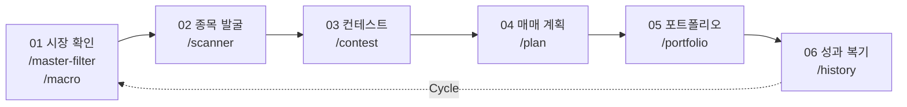
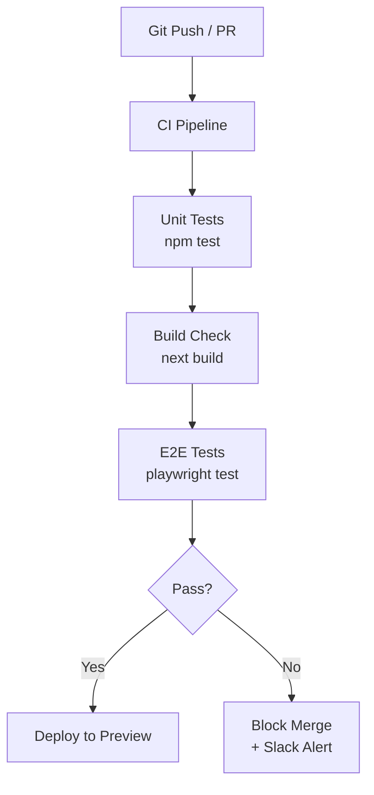

# MTN (Mantori's Trading Navigator) End-to-End 테스트 계획서

> **문서 버전**: v1.0  
> **작성자**: QA 시니어 엔지니어  
> **작성일**: 2026-05-23  
> **대상 시스템**: MTN v0.1.0 (Next.js 16 / TypeScript / Supabase)

---

## 1. 개요

### 1.1 목적
MTN은 **Minervini SEPA/VCP 전략 기반의 투자 의사결정 지원 시스템**으로, 시장 분석 → 종목 발굴 → 후보 심사 → 매매 계획 → 포트폴리오 관리 → 성과 복기라는 **6단계 투자 워크플로우**를 하나의 플랫폼에서 제공합니다.

본 E2E 테스트 계획은 이 **전체 워크플로우가 사용자 관점에서 끊김 없이 올바르게 동작하는지**를 검증하는 것을 목표로 합니다.

### 1.2 테스트 범위



### 1.3 현재 테스트 현황 분석

| 구분 | 현재 상태 | 파일 수 | 비고 |
|------|-----------|---------|------|
| 단위 테스트 | ✅ 존재 | 28개 | SEPA, VCP, Contest, Trade Metrics 등 핵심 로직 커버 |
| 통합 테스트 (Logic E2E) | ✅ 부분 존재 | 1개 | [e2e-lifecycle.test.mjs](file:///Users/mantori/vibecoding/MTN/tests/e2e-lifecycle.test.mjs) — 비즈니스 로직 플로우만 검증 |
| 브라우저 E2E 테스트 | ❌ 미존재 | 0개 | **본 계획의 핵심 대상** |
| API 통합 테스트 | ❌ 미존재 | 0개 | API Route 실제 호출 검증 필요 |

> [!IMPORTANT]
> 기존 `e2e-lifecycle.test.mjs`는 비즈니스 로직 단위의 함수 호출 체인을 검증하는 **로직 E2E**이며, 실제 브라우저 렌더링·네비게이션·API 호출·DB 상태 변경을 포함하는 **진정한 E2E**가 아닙니다. 본 계획은 이 갭을 메우는 것이 핵심입니다.

---

## 2. 시스템 아키텍처 분석

### 2.1 기술 스택

| 레이어 | 기술 | 테스트 관련 영향 |
|--------|------|-----------------|
| Frontend | Next.js 16 (App Router) + React 19 + Framer Motion | CSR 컴포넌트 위주, `'use client'` 다수 |
| Styling | Tailwind CSS v4 | 시각적 회귀 테스트 필요 |
| Backend | Next.js API Routes (Route Handlers) | 20개 API 엔드포인트 |
| Database | Supabase (PostgreSQL + RLS) | 테스트용 DB 환경 격리 필요 |
| Auth | Custom Session (`MTN_ADMIN_USERNAME/PASSWORD`) | 모든 API에 인증 의존 |
| AI/LLM | Google Gemini (+ Groq, Cerebras fallback) | 외부 API Mock 필수 |
| External API | KIS (증권사), Yahoo Finance, SEC EDGAR | 외부 API Mock/Stub 필수 |
| Notifications | Telegram Bot | Webhook Mock 필요 |

### 2.2 핵심 페이지 및 라우트 맵

| 단계 | 라우트 | 페이지 명칭 | 핵심 기능 |
|------|--------|------------|-----------|
| — | `/login` | 로그인 | 관리자 인증 |
| — | `/` | Command Center | 대시보드, 시장 상태, 다음 행동 제안 |
| 01 | `/master-filter` | 마스터 필터 | GREEN/YELLOW/RED 시장 판정 |
| 01 | `/macro` | 매크로 분석 | 글로벌 자금 흐름 점수화, 레짐 판정 |
| 02 | `/scanner` | 미너비니 스크리너 | SEPA/VCP 기반 종목 스캔 |
| 03 | `/contest` | 뷰티 컨테스트 | LLM 기반 후보 순위 심사 |
| 03 | `/(dashboard)/canslim` | CANSLIM 분석 | CAN SLIM 기준 분석 |
| 04 | `/plan` | 매매 계획 | SEPA 검증 → VCP 분석 → 리스크 산출 → 체크리스트 → 저장 |
| 05 | `/portfolio` | 포트폴리오 리스크 | 총 노출, 섹터 집중도, 활성 포지션 |
| 06 | `/history` | 성과 복기 | 매매 이력, 실수 태그, 승률/기대값 통계 |

### 2.3 API 엔드포인트 목록 (20개)

| API Route | 메서드 | 기능 | 우선순위 |
|-----------|--------|------|----------|
| `/api/auth` | POST | 로그인/로그아웃 | 🔴 Critical |
| `/api/trades` | GET/POST/PATCH | 매매 계획 CRUD | 🔴 Critical |
| `/api/trade-executions` | POST/PATCH | 체결 기록 관리 | 🔴 Critical |
| `/api/scanner` | GET/POST | 스캐너 실행/결과 조회 | 🔴 Critical |
| `/api/contest` | GET/POST | 컨테스트 세션 관리 | 🔴 Critical |
| `/api/macro` | GET | 매크로 데이터 조회 | 🟡 High |
| `/api/macro/history` | GET | 매크로 이력 조회 | 🟡 High |
| `/api/master-filter` | GET | 마스터 필터 상태 | 🟡 High |
| `/api/portfolio` | GET | 포트폴리오 조회 | 🟡 High |
| `/api/market-data` | GET | 시장 데이터 조회 | 🟡 High |
| `/api/price-history` | GET | 가격 이력 조회 | 🟡 High |
| `/api/watchlist` | GET/POST/DELETE | 관심 종목 관리 | 🟢 Medium |
| `/api/trade-exit-rules` | GET/POST | 청산 규칙 관리 | 🟢 Medium |
| `/api/trade-stop-events` | GET/POST | 손절 이벤트 | 🟢 Medium |
| `/api/security-lookup` | GET | 종목 검색 | 🟢 Medium |
| `/api/resources` | GET | 리소스 조회 | ⚪ Low |
| `/api/telegram-webhook` | POST | 텔레그램 웹훅 | ⚪ Low |
| `/api/cron/*` | POST | 배치 작업 (7개 하위) | ⚪ Low |
| `/api/admin` | GET/POST | 관리자 기능 | ⚪ Low |
| `/api/test` / `/api/test-report` | GET | 테스트/리포트 | ⚪ Low |

---

## 3. E2E 테스트 전략

### 3.1 테스트 도구 선정

| 도구 | 용도 | 선정 사유 |
|------|------|-----------|
| **Playwright** | 브라우저 E2E | Next.js 공식 권장, 멀티 브라우저, API Mocking 내장 |
| **MSW (Mock Service Worker)** | 외부 API Mock | KIS, Yahoo, Gemini 등 외부 의존성 격리 |
| **Supabase Test Helper** | DB 격리 | 테스트별 트랜잭션 롤백 또는 시드 데이터 관리 |
| **@playwright/test** | 테스트 러너 | 병렬 실행, 리포팅, 스크린샷 비교 내장 |

### 3.2 테스트 환경 구성

```
┌─────────────────────────────────────────────────┐
│                  E2E Test Runner                │
│              (Playwright + MSW)                 │
├─────────────────────────────────────────────────┤
│  Next.js Dev Server (localhost:3000)            │
│  ├── App Routes (Frontend)                      │
│  └── API Routes (Backend)                       │
├─────────────────────────────────────────────────┤
│  Supabase Local (Docker) 또는 Test Project      │
│  └── Seeded Test Data                           │
├─────────────────────────────────────────────────┤
│  External API Mocks (MSW)                       │
│  ├── KIS API Mock                               │
│  ├── Yahoo Finance Mock                         │
│  ├── Gemini AI Mock                             │
│  └── Telegram Bot Mock                          │
└─────────────────────────────────────────────────┘
```

### 3.3 테스트 데이터 전략

| 데이터 유형 | 전략 | 상세 |
|------------|------|------|
| 시장 데이터 (주가, 지표) | **Fixture 파일** | 결정론적 테스트를 위해 고정된 JSON fixture 사용 |
| 사용자 데이터 (매매 기록) | **시드 스크립트** | 각 테스트 시나리오별 사전 데이터 주입 |
| LLM 응답 | **Mock 응답** | 고정된 컨테스트 심사 결과 JSON |
| 인증 토큰 | **테스트용 고정값** | `.env.test` 환경 변수 |

---

## 4. 테스트 시나리오 설계

### 4.1 TC-AUTH: 인증 플로우

> **목적**: 로그인/로그아웃 및 인증 보호 경로 검증

| ID | 시나리오 | 기대 결과 | 우선순위 |
|----|---------|-----------|----------|
| AUTH-01 | 올바른 자격증명으로 로그인 | 로그인 성공 → Command Center 리다이렉트 | 🔴 P0 |
| AUTH-02 | 잘못된 비밀번호로 로그인 시도 | 에러 메시지 표시, 로그인 상태 유지되지 않음 | 🔴 P0 |
| AUTH-03 | 미인증 상태에서 보호 페이지 접근 | `/login`으로 리다이렉트 | 🔴 P0 |
| AUTH-04 | 로그아웃 후 보호 페이지 접근 | `/login`으로 리다이렉트 | 🟡 P1 |
| AUTH-05 | 세션 만료 시 API 호출 | 401 응답 + 재로그인 유도 | 🟡 P1 |

---

### 4.2 TC-DASH: Command Center (대시보드)

> **목적**: 메인 대시보드의 데이터 표시 및 내비게이션 정확성 검증

| ID | 시나리오 | 기대 결과 | 우선순위 |
|----|---------|-----------|----------|
| DASH-01 | 대시보드 초기 로드 (미국 시장) | 시장 상태, 매크로 레짐, 오픈 리스크 카드 표시 | 🔴 P0 |
| DASH-02 | 한국 시장으로 전환 | KR 시장 데이터로 카드 갱신, 통화 ₩ 표시 | 🔴 P0 |
| DASH-03 | Next Action 영역의 CTA 버튼 클릭 | 올바른 다음 단계 페이지로 이동 | 🟡 P1 |
| DASH-04 | 관심 후보 목록 → Plan 페이지 이동 | ticker/exchange 쿼리 파라미터 전달 확인 | 🟡 P1 |
| DASH-05 | 최근 매매 흐름 → History 상세 이동 | tradeId 기반 상세 페이지 로드 | 🟡 P1 |
| DASH-06 | 워크플로우 스텝 링크 (01~05) 클릭 | 각 스텝의 올바른 페이지로 이동 | 🟢 P2 |
| DASH-07 | 데이터 없을 때 Empty State 표시 | "아직 표시할 관심 후보/매매 기록이 없습니다" 메시지 | 🟢 P2 |
| DASH-08 | API 오류 시 에러 배너 | 에러 메시지가 amber 배너로 표시 | 🟢 P2 |

---

### 4.3 TC-MACRO: 매크로 분석

> **목적**: 글로벌 자금 흐름 점수화 및 레짐 판정 UI 검증

| ID | 시나리오 | 기대 결과 | 우선순위 |
|----|---------|-----------|----------|
| MACRO-01 | RISK_ON 레짐 (score ≥ 70) | 녹색 톤 Regime Hero Card, "위험자산 향하는 국면" 해석 표시 | 🔴 P0 |
| MACRO-02 | NEUTRAL 레짐 (45 ≤ score < 70) | 앰버 톤, "혼재하는 경계 구간" 해석 | 🟡 P1 |
| MACRO-03 | RISK_OFF 레짐 (score < 45) | 레드 톤, "방어적 국면" 해석, 신규 진입 중단 안내 | 🟡 P1 |
| MACRO-04 | 자산 그리드 8개 카드 표시 | SPY, QQQ, HYG, IEF, TLT, GLD, VIX, BTC-USD 모두 표시 | 🔴 P0 |
| MACRO-05 | 상대강도 비교 3개 비율 카드 | QQQ/SPY, HYG/IEF, IWM/SPY 표시 | 🟡 P1 |
| MACRO-06 | 매크로 데이터 로딩 실패 | 스카이블루 알림 배너 + "매크로 데이터 미채점" 안내 | 🟡 P1 |
| MACRO-07 | "마스터 필터" CTA 클릭 | `/master-filter`로 정상 이동 | 🟢 P2 |
| MACRO-08 | LLM Briefing 컴포넌트 렌더링 | 레짐에 따른 AI 브리핑 표시 | 🟢 P2 |

---

### 4.4 TC-MF: 마스터 필터

> **목적**: 시장 진입 게이트(GREEN/YELLOW/RED) 판정 검증

| ID | 시나리오 | 기대 결과 | 우선순위 |
|----|---------|-----------|----------|
| MF-01 | GREEN 판정 시 UI | 녹색 표시, "진입 가능" 상태, 스캐너 연결 가능 | 🔴 P0 |
| MF-02 | YELLOW 판정 시 UI | 앰버 표시, 경고 메시지, 제한적 진입 안내 | 🔴 P0 |
| MF-03 | RED 판정 시 UI | 레드 표시, "신규 진입 금지" 명확한 차단 메시지 | 🔴 P0 |
| MF-04 | DecisionBox 컴포넌트 렌더링 | 현재 판정에 따른 운용 가이드라인 표시 | 🟡 P1 |

---

### 4.5 TC-SCAN: 미너비니 스크리너

> **목적**: SEPA/VCP 종목 스캔 실행부터 결과 표시, 워치리스트 추가까지의 전체 플로우 검증

| ID | 시나리오 | 기대 결과 | 우선순위 |
|----|---------|-----------|----------|
| SCAN-01 | Universe 선택 후 스캔 시작 | 프로그레스 바 표시, 순차 스캔 진행 | 🔴 P0 |
| SCAN-02 | 스캔 결과 Tier별 카운트 | Recommended / Action / IB Review / Errors 카드 정확한 집계 | 🔴 P0 |
| SCAN-03 | 테이블 뷰 ↔ 카드 뷰 전환 | viewMode 토글 시 동일 데이터 다른 레이아웃 | 🟡 P1 |
| SCAN-04 | 필터 탭 전환 (전체 / Recommended 등) | filterKey 변경 시 목록 필터링 | 🔴 P0 |
| SCAN-05 | 정렬 변경 (RS Rating, VCP Score 등) | sortKey 변경 시 목록 재정렬 | 🟡 P1 |
| SCAN-06 | 상세 필터 (RS Min, VCP Min, 피벗 거리) | 슬라이더 조작 → 실시간 필터 적용 | 🟡 P1 |
| SCAN-07 | 종목 선택 (체크박스, 최대 15개) | 선택 카운터 갱신, 15개 초과 시 경고 | 🔴 P0 |
| SCAN-08 | 종목 클릭 → VCP Drilldown 모달 | 모달에 VCP 상세 분석 정보 표시 | 🟡 P1 |
| SCAN-09 | 워치리스트 추가 | API 호출 성공 후 확인 피드백 | 🟡 P1 |
| SCAN-10 | "콘테스트로 이동" 플로팅 버튼 | 선택 종목 상태 유지하며 `/contest`로 이동 | 🔴 P0 |
| SCAN-11 | HALT 상태에서 스캔 차단 | 스캔 버튼 비활성화, 차단 메시지 표시 | 🔴 P0 |
| SCAN-12 | 스캔 중단 (중단 버튼) | 스캔 즉시 중단, 현재까지 결과 유지 | 🟡 P1 |
| SCAN-13 | 텔레그램 전송 버튼 | 후보 요약 텔레그램 발송, 상태 피드백 | 🟢 P2 |
| SCAN-14 | Empty State (결과 없음) | "후보 발굴을 시작하세요" UI + Strategy Tips | 🟢 P2 |
| SCAN-15 | Near-miss 진단 히스토그램 | Recommended 카드 툴팁에 차단 사유 분포 표시 | 🟢 P2 |

---

### 4.6 TC-CONTEST: 뷰티 컨테스트 (LLM 심사)

> **목적**: LLM 기반 후보 심사 세션 생성, 응답 파싱, 결과 표시 검증

| ID | 시나리오 | 기대 결과 | 우선순위 |
|----|---------|-----------|----------|
| CON-01 | 스캐너에서 선택된 후보로 세션 생성 | prompt 빌드 → LLM 호출 → 응답 정규화 | 🔴 P0 |
| CON-02 | LLM 응답 결과 렌더링 | 각 후보의 rank, recommendation, confidence 표시 | 🔴 P0 |
| CON-03 | PROCEED / WATCH / SKIP 분류 | 추천 상태별 시각적 구분 (색상, 배지) | 🟡 P1 |
| CON-04 | 최종 선별 후 Plan Queue 전달 | localStorage에 `contest-plan-queue` 저장 → `/plan` 이동 | 🔴 P0 |
| CON-05 | LLM 응답 파싱 오류 처리 | 잘못된 JSON 응답 시 에러 메시지 | 🟡 P1 |
| CON-06 | 시장별 컨테스트 (US / KR) | universe와 시장 컨텍스트가 프롬프트에 반영 | 🟡 P1 |

---

### 4.7 TC-PLAN: 매매 계획

> **목적**: 종목 분석(SEPA + VCP) → 리스크 산출 → 체크리스트 → 저장까지의 전체 계획 수립 플로우 검증

| ID | 시나리오 | 기대 결과 | 우선순위 |
|----|---------|-----------|----------|
| PLAN-01 | 티커 입력 + 분석 실행 | SEPA 판정, VCP 분석, 리스크 계산 결과 표시 | 🔴 P0 |
| PLAN-02 | 스캐너/컨테스트에서 자동 분석 | `?ticker=NVDA&exchange=NAS&autoAnalyze=1` → 자동 분석 실행 | 🔴 P0 |
| PLAN-03 | Contest Plan Queue 배너 | 선별된 종목 리스트 배너 + 각 종목 링크 | 🟡 P1 |
| PLAN-04 | SEPA 판정 결과 표시 | pass/warning/fail 상태, 코어 기준 집계, RS 소스 배지 | 🔴 P0 |
| PLAN-05 | VCP 분석 패널 | grade, score, 피벗 가격, 수축 단계, 매집 신호 | 🟡 P1 |
| PLAN-06 | 리스크 계산기 | 총 자산, 허용 리스크%, 진입가/손절가/포지션 크기 | 🔴 P0 |
| PLAN-07 | Centaur 체크리스트 완성 | 7개 항목 체크 → 체크리스트 객체 생성 | 🔴 P0 |
| PLAN-08 | 계획 저장 (POST /api/trades) | 저장 성공 → "계획 저장 완료" 배너 + 포트폴리오/대시보드 링크 | 🔴 P0 |
| PLAN-09 | SEPA fail 시 저장 차단 | 저장 버튼 비활성화 | 🟡 P1 |
| PLAN-10 | 저장 실패 시 에러 표시 | 인라인 에러 메시지 (red 배너) + 닫기 버튼 | 🟡 P1 |
| PLAN-11 | 미국 ↔ 한국 시장 전환 | 통화 표시(USD/KRW) 변경, exchange 기본값 변경 | 🟡 P1 |

---

### 4.8 TC-PORT: 포트폴리오 리스크

> **목적**: 포트폴리오 전체 리스크 현황과 개별 포지션 상태 표시 검증

| ID | 시나리오 | 기대 결과 | 우선순위 |
|----|---------|-----------|----------|
| PORT-01 | 포트폴리오 요약 카드 5개 | 총 자산, 투입 금액, 현금, 오픈 리스크, 보유 포지션 | 🔴 P0 |
| PORT-02 | 섹터 노출도 차트 | 섹터별 바 차트 + 비율(%) | 🟡 P1 |
| PORT-03 | 활성 포지션 카드 | 티커, 섹터, 노출 금액, 평균 단가, 현재가, 평가손익 | 🔴 P0 |
| PORT-04 | 피라미딩/부분매도 횟수 표시 | 배지로 각 횟수 표시 | 🟡 P1 |
| PORT-05 | 미국 ↔ 한국 시장 전환 | 통화 및 포지션 제한 규칙 변경 | 🟡 P1 |
| PORT-06 | 포지션 없을 때 | "현재 활성 포지션이 없습니다" 메시지 | 🟢 P2 |
| PORT-07 | 경고 메시지 (집중도 초과 등) | amber 경고 배너 표시 | 🟡 P1 |

---

### 4.9 TC-HIST: 성과 복기

> **목적**: 매매 이력 조회, 복기 작성, 성과 통계 표시 검증

| ID | 시나리오 | 기대 결과 | 우선순위 |
|----|---------|-----------|----------|
| HIST-01 | 복기 목록 뷰 로드 | 매매 이력 테이블 표시 (티커, 상태, 날짜 등) | 🔴 P0 |
| HIST-02 | 성과 통계 뷰 전환 | 승률, PnL, R배수, 기대값, 계획 준수율 카드 | 🔴 P0 |
| HIST-03 | 매매 상세 페이지 (`/history/[tradeId]`) | 개별 매매의 진입/청산 상세 + 복기 노트 | 🔴 P0 |
| HIST-04 | 실수 태그 필터 | ReviewStatsDashboard에서 실수 태그 클릭 → 해당 매매만 필터 | 🟡 P1 |
| HIST-05 | 미국 ↔ 한국 시장 전환 | URL 파라미터 `?market=KR` 반영 | 🟡 P1 |
| HIST-06 | 복기 목록 ↔ 성과 통계 URL 동기화 | `?view=stats` 파라미터와 UI 탭 동기화 | 🟡 P1 |

---

### 4.10 TC-E2E: 전체 워크플로우 통합 시나리오

> **목적**: 사용자의 실제 투자 의사결정 사이클을 처음부터 끝까지 시뮬레이션

#### 시나리오 A: 정상 흐름 (RISK_ON + 강한 후보)

```
로그인 → 대시보드 확인 → 마스터 필터(GREEN) → 매크로(RISK_ON)
→ 스캐너 실행 → Recommended 종목 선택 → 컨테스트(PROCEED)
→ 매매 계획 수립 → 체크리스트 완성 → 저장
→ 포트폴리오 확인 → 체결 기록 추가
→ 성과 복기 작성 → 대시보드로 복귀
```

| ID | 검증 포인트 | 우선순위 |
|----|------------|----------|
| E2E-A01 | 로그인 후 대시보드에 시장 상태 표시 | 🔴 P0 |
| E2E-A02 | 마스터 필터 GREEN → 스캐너 접근 가능 | 🔴 P0 |
| E2E-A03 | 스캔 실행 → Recommended 종목 존재 | 🔴 P0 |
| E2E-A04 | 선택 종목 → 컨테스트 전달 → PROCEED 판정 | 🔴 P0 |
| E2E-A05 | 계획 저장 → DB에 trade 레코드 생성 확인 | 🔴 P0 |
| E2E-A06 | 포트폴리오에 신규 포지션 반영 | 🔴 P0 |
| E2E-A07 | 히스토리에 매매 이력 표시 | 🔴 P0 |

#### 시나리오 B: 방어적 흐름 (RISK_OFF / HALT)

```
로그인 → 대시보드 → 마스터 필터(RED) → 매크로(RISK_OFF)
→ 스캐너 접근 시 HALT 차단 확인
→ 기존 포트폴리오의 포지션 정리 확인
→ 대시보드의 다음 행동 제안이 "현금 확보"로 변경
```

| ID | 검증 포인트 | 우선순위 |
|----|------------|----------|
| E2E-B01 | RED 상태에서 스캐너 스캔 차단 | 🔴 P0 |
| E2E-B02 | HALT 상태 배너 메시지 | 🟡 P1 |
| E2E-B03 | 대시보드 Next Action이 방어적 조언으로 변경 | 🟡 P1 |

#### 시나리오 C: 에러 복원 (네트워크 장애, 데이터 없음)

| ID | 검증 포인트 | 우선순위 |
|----|------------|----------|
| E2E-C01 | API 타임아웃 시 각 페이지 에러 UI 표시 | 🟡 P1 |
| E2E-C02 | 매크로 데이터 미채점 시 안내 메시지 | 🟡 P1 |
| E2E-C03 | 스캔 중 네트워크 끊김 → 중단 + 부분 결과 유지 | 🟡 P1 |

---

## 5. 비기능 테스트

### 5.1 반응형 디자인 (Responsive)

| ID | 시나리오 | 검증 대상 | 우선순위 |
|----|---------|-----------|----------|
| RESP-01 | 모바일 (375px) 전체 페이지 | 레이아웃 붕괴 없음, 터치 타겟 충분 | 🟡 P1 |
| RESP-02 | 태블릿 (768px) 전체 페이지 | 그리드 레이아웃 적절한 변환 | 🟢 P2 |
| RESP-03 | 스캐너 모바일 강제 카드 뷰 | `useIsMobile()` 시 테이블 뷰 숨김 | 🟡 P1 |
| RESP-04 | 내비게이션 바 모바일 대응 | 텍스트 잘림 없음, 햄버거 메뉴 동작 | 🟡 P1 |

### 5.2 성능 (Performance)

| ID | 시나리오 | 기준 | 우선순위 |
|----|---------|------|----------|
| PERF-01 | 대시보드 FCP (First Contentful Paint) | < 2초 | 🟡 P1 |
| PERF-02 | 스캐너 500종목 스캔 완료 시간 | < 5분 (네트워크 제외) | 🟡 P1 |
| PERF-03 | 포트폴리오 페이지 로드 (10 포지션) | < 3초 | 🟢 P2 |

### 5.3 접근성 (Accessibility)

| ID | 시나리오 | 기준 | 우선순위 |
|----|---------|------|----------|
| A11Y-01 | 키보드 내비게이션 | Tab 순서 논리적, Enter/Space 동작 | 🟢 P2 |
| A11Y-02 | 에러 영역 role="alert" | 스크린 리더 인식 | 🟢 P2 |
| A11Y-03 | 색상 대비 (다크 모드) | WCAG AA 이상 | 🟢 P2 |

---

## 6. 테스트 실행 계획

### 6.1 구현 우선순위 (Wave 방식)

```
PLAN: MTN E2E 테스트 구현
├── Wave 1 (인프라): Playwright 설정 | MSW Mock 서버 | 테스트 DB 시딩 | Auth Helper
├── Wave 2 (Critical Path): TC-AUTH | TC-PLAN | TC-PORT | E2E 시나리오 A
├── Wave 3 (Scanner Flow): TC-SCAN | TC-CONTEST | TC-MF
├── Wave 4 (Analytics): TC-DASH | TC-MACRO | TC-HIST
└── Wave 5 (Non-functional): RESP | PERF | A11Y | E2E 시나리오 B, C
Checkpoint: 각 Wave 완료 후 CI 파이프라인에서 전체 회귀 테스트 실행
```

### 6.2 예상 테스트 수 및 소요 시간

| Wave | 테스트 수 | 예상 구현 기간 | 자동 실행 시간 |
|------|----------|--------------|---------------|
| Wave 1 (인프라) | — | 2일 | — |
| Wave 2 (Critical) | ~25개 | 3일 | ~3분 |
| Wave 3 (Scanner) | ~20개 | 3일 | ~4분 |
| Wave 4 (Analytics) | ~20개 | 2일 | ~2분 |
| Wave 5 (Non-func) | ~15개 | 2일 | ~2분 |
| **합계** | **~80개** | **12일** | **~11분** |

### 6.3 파일 구조

```
tests/
├── e2e/                           # 브라우저 E2E 테스트
│   ├── fixtures/                  # 테스트 데이터 fixture
│   │   ├── market-data.json       # 시장 데이터 (주가, 지표)
│   │   ├── scanner-results.json   # 스캐너 결과 mock
│   │   ├── contest-response.json  # LLM 응답 mock
│   │   └── seed-trades.json       # 사전 매매 데이터
│   ├── mocks/                     # MSW 핸들러
│   │   ├── handlers.ts            # 전체 API mock 핸들러
│   │   ├── kis-api.ts             # KIS 증권사 API mock
│   │   ├── yahoo-finance.ts       # Yahoo Finance mock
│   │   └── gemini-ai.ts           # Gemini AI mock
│   ├── helpers/                   # 테스트 유틸
│   │   ├── auth.ts                # 로그인 헬퍼
│   │   ├── db-seed.ts             # DB 시딩 유틸
│   │   └── page-objects.ts        # 페이지 객체 패턴
│   ├── auth.spec.ts               # TC-AUTH
│   ├── dashboard.spec.ts          # TC-DASH
│   ├── macro.spec.ts              # TC-MACRO
│   ├── master-filter.spec.ts      # TC-MF
│   ├── scanner.spec.ts            # TC-SCAN
│   ├── contest.spec.ts            # TC-CONTEST
│   ├── plan.spec.ts               # TC-PLAN
│   ├── portfolio.spec.ts          # TC-PORT
│   ├── history.spec.ts            # TC-HIST
│   └── full-workflow.spec.ts      # TC-E2E (A, B, C 시나리오)
├── *.test.mjs                     # 기존 단위 테스트 (유지)
└── playwright.config.ts           # Playwright 설정
```

### 6.4 CI/CD 통합



---

## 7. 리스크 및 의존성

| 리스크 | 영향도 | 완화 방안 |
|--------|--------|-----------|
| Supabase 테스트 DB 격리 어려움 | 🔴 높음 | Supabase Local (Docker) 또는 별도 test 프로젝트 |
| 외부 API (KIS, Yahoo) 불안정 | 🔴 높음 | MSW Mock 완전 격리, fixture 기반 테스트 |
| LLM 응답 비결정론적 | 🟡 중간 | 고정 mock 응답 사용, normalize 함수만 단위 테스트로 보완 |
| `.env.local` 없이 로컬 개발 불가 | 🟡 중간 | `.env.test` 전용 파일 + CI secrets 관리 |
| 스캐너 스캔 시간 (외부 API 의존) | 🟡 중간 | E2E에서는 Mock 데이터로 즉시 응답 |
| Framer Motion 애니메이션 타이밍 | 🟢 낮음 | `AnimatePresence` 완료 대기 또는 테스트 시 애니메이션 비활성화 |

---

## 8. 종료 기준 (Exit Criteria)

| 기준 | 목표 |
|------|------|
| P0 테스트 통과율 | **100%** |
| P1 테스트 통과율 | **≥ 95%** |
| P2 테스트 통과율 | **≥ 90%** |
| 전체 E2E 실행 시간 | **≤ 15분** |
| 발견된 Critical 버그 | **0건 (미해결)** |
| 전체 워크플로우 시나리오 A 통과 | **필수** |

---

## User Review Required

> [!IMPORTANT]
> **승인이 필요한 결정 사항:**
> 1. **테스트 도구**: Playwright + MSW 조합으로 진행해도 괜찮으신지?  (대안: Cypress)
> 2. **테스트 DB**: Supabase Local (Docker) vs 별도 Supabase Test 프로젝트 중 선호하시는 방식?
> 3. **구현 범위**: Wave 1~5 전체를 진행할지, 우선 Wave 1~2 (인프라 + Critical Path)만 먼저 진행할지?
> 4. **CI 통합**: 현재 GitHub Actions 사용 여부 및 CI 파이프라인 구성 희망 여부?

## Open Questions

> [!NOTE]
> 1. 현재 Supabase 프로젝트에 테스트용 별도 스키마나 DB가 이미 존재하나요?
> 2. KIS API의 가상 계좌(`KIS_VIRTUAL_APP_KEY`)가 테스트 환경에서 사용 가능한가요?
> 3. Vercel Preview 환경에서 E2E 테스트를 실행할 계획이 있나요?
> 4. 텔레그램 봇 테스트용 별도 채팅방이 있나요?
