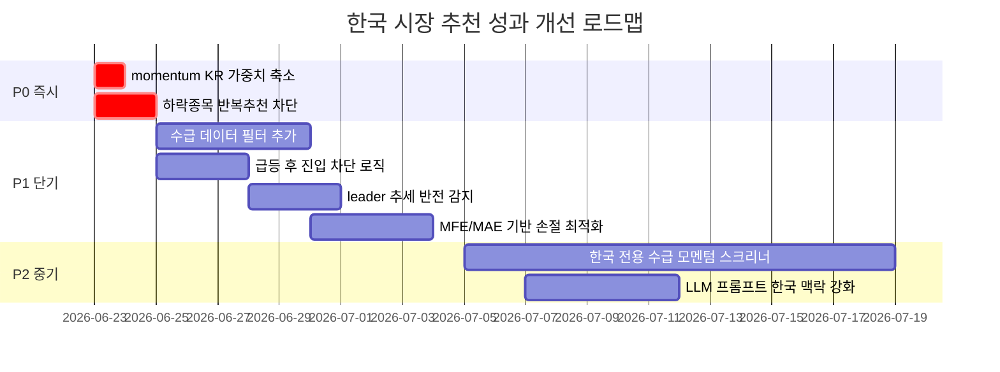

# 추천 종목 성과 분석 리포트: 미국 vs 한국 시장

> **분석 기간**: 2026-06-12 ~ 2026-06-18 (LIVE 호라이즌, 5영업일)
> **데이터**: recommendation_performance 100건(US 50, KR 50), diagnostic_findings 50건(US 11, KR 39)
> **작성일**: 2026-06-22

---

## 1. 핵심 요약 (Executive Summary)

| 지표 | 🇺🇸 미국 | 🇰🇷 한국 | 차이 |
|------|---------|---------|------|
| **적중률** (양수 수익) | **84.0%** | 40.0% | -44.0%p |
| **벤치마크 초과 성공률** | **72.0%** | 40.0% | -32.0%p |
| **평균 수익률** | **+3.42%** | -0.82% | -4.24%p |
| **중앙값 수익률** | **+2.85%** | -2.14% | -4.99%p |
| **평균 초과수익** | **+2.62%** | -2.18% | -4.80%p |
| **평균 MFE** | +6.78% | +9.02% | +2.24%p |
| **평균 MAE** | -3.20% | **-7.95%** | -4.75%p |
| 진단 파인딩 수 | 11 | **39** | +28건 |
| CRITICAL 파인딩 | 0 | **12** | +12건 |

> [!CAUTION]
> 한국 시장은 적중률 40%, 평균 수익률 -0.82%로 **투자 가치가 없는 수준**입니다. 특히 `momentum` 소스의 평균 수익률이 -7.24%로 치명적이며, 전체 성과를 크게 끌어내리고 있습니다.

---

## 2. 소스별 성과 비교

### 🇺🇸 미국 소스별 성과 (LIVE)

| 소스 | 표본 | 적중률 | 벤치마크 초과률 | 평균 수익률 | 평균 초과수익 |
|------|------|--------|----------------|-------------|-------------|
| **leader** | 9 | **100.0%** | **100.0%** | **+7.01%** | **+6.08%** |
| **mixed** | 17 | 88.2% | 88.2% | +5.76% | +5.25% |
| **qullamaggie** | 7 | 85.7% | 71.4% | +1.80% | +1.07% |
| canslim | 17 | 70.6% | 41.2% | -0.16% | -1.22% |

### 🇰🇷 한국 소스별 성과 (LIVE)

| 소스 | 표본 | 적중률 | 벤치마크 초과률 | 평균 수익률 | 평균 초과수익 |
|------|------|--------|----------------|-------------|-------------|
| minervini | 2 | 100.0% | 100.0% | +1.66% | +3.05% |
| qullamaggie | 2 | 100.0% | 50.0% | +3.26% | +0.02% |
| **mixed** | 21 | 47.6% | 57.1% | +4.12% | +2.07% |
| leader | 11 | 36.4% | 27.3% | -3.28% | -3.63% |
| **momentum** | **14** | **14.3%** | **14.3%** | **-7.24%** | **-8.47%** |

> [!IMPORTANT]
> **한국 시장 부진의 최대 원인은 `momentum` 소스입니다.**
> - 14건 중 12건이 손실, 적중률 14.3%, 평균 -7.24%
> - 미국에는 `momentum` 소스 추천이 **0건**인 반면, 한국은 **14건(28%)**이 momentum
> - `leader` 소스도 11건 중 7건 손실, 평균 -3.28%로 부진

---

## 3. 근본 원인 분석

### 원인 1: 🔴 `momentum` 스크리너의 구조적 결함 (기여도: ~55%)

```
KR momentum 14건: hitRate=14.3%, avgReturn=-7.24%, avgExcess=-8.47%
```

**문제점**:
- `momentum` 스크리너는 당일 거래량 급증(RVOL)과 가격 변동률(ROC)을 기반으로 종목을 선별
- 이 방식은 **이미 급등한 종목을 추천**하는 구조로, 진입 시점이 고점 근처
- 한국 시장 특성상 테마주/소형주의 거래량 급증은 대부분 **1~2일 급등 후 되돌림** 패턴

**증거 — KR momentum worst picks**:

| 종목 | 수익률 | 초과수익 | MFE | MAE |
|------|--------|----------|-----|-----|
| HPSP(403870) | **-29.69%** | -22.39% | +1.24% | -32.05% |
| 한미반도체(042700) | -19.18% | -26.95% | +0.96% | -21.37% |
| 이오테크닉스(039030) | -16.64% | -8.24% | +1.17% | -20.40% |
| 한화에어로스페이스(012450) | -9.59% | -16.26% | +1.85% | -11.76% |
| HD현대중공업(329180) | -5.39% | -10.70% | +4.68% | -7.80% |

> MFE가 매우 낮고(+1~2%) MAE가 극단적(-20~32%)인 것은 **진입 직후 하락만 지속**됐음을 의미합니다.

**코드 근거** — [normalizeMomentumCandidate](file:///Users/mantori/vibecoding/MTN/lib/daily-screeners/index.ts#L298-L327):
```diff
 // 점수 산정이 RVOL과 ROC에 과도하게 의존
 const gradeBase = grade === 'EXPLOSIVE' ? 70 : grade === 'BREAKOUT' ? 55 : grade === 'WARM' ? 35 : 0;
 const score = round(clamp(gradeBase + Math.min(18, rvol * 4) + Math.min(12, Math.max(0, roc) * 1.2)));
 // → 추세 지속성, 기관 수급, 밸류에이션 필터 부재
```

---

### 원인 2: 🔴 한국 `leader` 스크리너의 과잉 집중 (기여도: ~20%)

한국 leader 11건 중 **주성엔지니어링(036930)이 5건**, **LG이노텍(011070)이 4건**을 차지합니다.

| 종목 | 추천 횟수 | 수익률 범위 | 비고 |
|------|-----------|-------------|------|
| 주성엔지니어링 | 5일 연속 | -18.69% ~ -11.83% | 전 건 손실 |
| LG이노텍 | 4일 연속 | -11.45% ~ -5.14% | 전 건 손실 |
| 삼성전기 | 1건 | +23.37% | 유일한 대성공 |

**문제점**:
- 동일 종목이 하락 추세 진입 후에도 계속 추천되는 **"하락 종목 반복 추천" 문제**
- Leader 스크리너가 RS/모멘텀 순위만으로 선별하여, **가격 하락이 시작되어도 과거 모멘텀 잔상**으로 계속 상위 랭크
- 미국 leader는 9건 중 **9건 전승**(평균 +7.01%)으로, 한국만의 문제

---

### 원인 3: 🟠 한국 시장 구조적 특성 미반영 (기여도: ~15%)

**추천 엔진은 미국 시장 중심으로 설계**되었습니다:

1. **SEPA/VCP 기반 필터의 한국 적합성 부족**
   - [evaluateScannerRecommendation](file:///Users/mantori/vibecoding/MTN/lib/scanner-recommendation.ts#L291-L516)은 Minervini의 SEPA와 VCP를 핵심 필터로 사용
   - 한국 시장은 VCP 패턴 발생 빈도가 낮고, 외국인/기관 수급이 주가 방향성을 결정하는 경우가 더 많음
   - 결과적으로 minervini 소스는 한국에서 **2건만 추천**

2. **변동성 비대칭**
   - 미국 avgMAE=-3.20% vs 한국 avgMAE=-7.95%: 한국이 2.5배 깊은 하락
   - 한국 avgMFE=+9.02% vs 미국 avgMFE=+6.78%: 한국의 상방도 크지만 **하방이 더 큼**
   - 손절 기준이 미국 시장 변동성에 맞춰져 있어, 한국에서는 더 빠른 대응 필요

3. **시가총액·유동성 편향**
   - KOSPI200/KOSDAQ150은 미국 대비 소형주 비중이 높고 유동성이 낮아 테마 쏠림에 취약
   - KODEX 200(069500), SK(034730) 같은 ETF/지주사가 추천에 포함되는 등 종목 품질 필터 부재

---

### 원인 4: 🟠 코호트별 성과 불안정 (기여도: ~10%)

| 날짜 | 🇺🇸 적중률 | 🇺🇸 평균수익 | 🇰🇷 적중률 | 🇰🇷 평균수익 |
|------|-----------|-------------|-----------|-------------|
| 06-12 | **100%** | +8.10% | 40% | -1.88% |
| 06-15 | 90% | +3.93% | 40% | -1.33% |
| 06-16 | 70% | +2.13% | 40% | +2.22% |
| 06-17 | 90% | +2.76% | 60% | +0.98% |
| 06-18 | 70% | +0.15% | **20%** | **-4.10%** |

- 미국은 최악 코호트(06-18)에서도 70% 적중, 평균 +0.15%
- 한국은 최악 코호트(06-18)에서 20% 적중, 평균 -4.10%
- **한국이 시장 하락기에 훨씬 취약**

---

## 4. 진단 파인딩 분석

| 원인 코드 | 🇺🇸 건수 | 🇺🇸 CRITICAL | 🇰🇷 건수 | 🇰🇷 CRITICAL |
|-----------|---------|-------------|---------|-------------|
| SELECTION (종목 선택) | 7 | 0 | **25** | **12** |
| ENTRY_TIMING (진입 시점) | 3 | 0 | 9 | 0 |
| MARKET_REGIME (시장 환경) | 1 | 0 | 5 | 0 |

> [!WARNING]
> 한국 CRITICAL SELECTION 파인딩 12건은 모두 **벤치마크 대비 -10% 이상 초과 하락**한 종목들입니다.
> 이는 시장 환경(MARKET_REGIME)이 아닌 **종목 선택 자체의 문제**임을 시사합니다.

---

## 5. 개선 방안

### 🔴 즉시 실행 (P0)

#### 5.1 `momentum` 소스 한국 시장 제외 또는 가중치 대폭 축소

**현재**: momentum 소스가 한국 Top10에 14/50건(28%) 차지
**목표**: momentum 소스를 KR 추천 풀에서 제외하거나, aggregate score에서 가중치를 50% 이하로 축소

```diff
# lib/daily-screeners/index.ts — aggregateDailyCandidates 수정
function aggregateDailyCandidates(candidates: DailyScreenerCandidate[]) {
  for (const candidate of candidates) {
+   // KR momentum 소스 페널티: 급등 후 되돌림 리스크가 높아 가중치 축소
+   const market = marketForDailyCandidate(candidate);
+   if (market === 'KR' && candidate.source === 'momentum') {
+     candidate.score = Math.round(candidate.score * 0.4);
+   }
    // ...existing aggregation logic
  }
}
```

#### 5.2 하락 종목 반복 추천 차단 (Cooling-off Period)

**현재**: 주성엔지니어링이 5일 연속 추천되며 매일 손실 누적
**목표**: 직전 3영업일 이내 추천 이력이 있고 수익률이 음수인 종목은 재추천 제외

```diff
# lib/daily-screeners/index.ts — ruleBasedDailyMarketTop10 수정
+ // 최근 추천 이력 조회 후 cooling-off 적용
+ async function filterRecentLosers(candidates, client, market) {
+   const recentPicks = await readRecentPicks(client, market, 3); // 최근 3일
+   const loserTickers = new Set(
+     recentPicks.filter(p => p.returnPct !== null && p.returnPct < -3).map(p => p.ticker)
+   );
+   return candidates.filter(c => !loserTickers.has(c.ticker));
+ }
```

### 🟠 단기 개선 (P1, 1~2주)

#### 5.3 한국 시장 전용 필터 추가

| 필터 | 설명 | 임계값 |
|------|------|--------|
| **외국인·기관 순매수** | KIS API 수급 데이터 활용 | 3일 연속 순매수 |
| **거래대금 필터** | 일평균 거래대금 하한 | KOSPI 50억+, KOSDAQ 20억+ |
| **급등 후 진입 차단** | 직전 3일 수익률이 +15% 이상이면 제외 | ROC(3d) < +15% |
| **ETF/지주사 제외** | 주가 지수 추종형 종목 제외 | 별도 제외 리스트 관리 |

#### 5.4 MFE/MAE 기반 손절 최적화

한국 시장의 MFE/MAE 비대칭 문제 해결:

```
현재: 미국과 동일한 손절 기준
개선: 한국 시장은 MAE 중앙값(-7.95%)을 고려해
      → 진입 후 -5% 이내 반등 없으면 조기 청산 신호
      → 진입 후 MFE +5% 도달 시 트레일링 스톱 활성화
```

#### 5.5 `leader` 스크리너에 추세 반전 감지 추가

```diff
# normalizeLeaderCandidate 수정
+ // 최근 5일 수익률이 -5% 미만이면 리더 점수 50% 감산
+ const recentReturn = numberOrNull(data.return5d);
+ if (recentReturn !== null && recentReturn < -5) {
+   score = round(score * 0.5);
+ }
```

### 🟡 중기 개선 (P2, 1~2개월)

#### 5.6 한국 시장 전용 스크리너 개발

미국 중심의 SEPA/VCP/CANSLIM 프레임워크 대신, 한국 시장에 적합한 스크리너:

| 전략 | 핵심 요소 | 근거 |
|------|-----------|------|
| **수급 모멘텀** | 외국인·기관 동시 순매수 + 가격 상승 | 한국 시장은 수급이 주가 결정의 핵심 |
| **실적 서프라이즈** | 컨센서스 대비 실적 상향 + 목표주가 상향 | 대형주 위주 애널리스트 커버리지 활용 |
| **섹터 로테이션** | 코스피 업종지수 상대강도 상위 섹터 내 종목 | 한국은 섹터 쏠림이 심함 |

#### 5.7 LLM 프롬프트 한국 시장 전용 맥락 강화

[buildDailyMarketTop10Prompt](file:///Users/mantori/vibecoding/MTN/lib/daily-screeners/index.ts#L658-L694)의 평가 프레임에 한국 시장 특화 지침 추가:

```diff
 '평가 프레임: ...',
+ '한국 시장 특화 고려사항:',
+ '- momentum/RVOL 급등 종목은 고점 추격 리스크가 높으므로 신중하게 평가',
+ '- 동일 종목이 3일 이상 연속 추천된 경우 하향 편향 적용',
+ '- 외국인/기관 수급 방향이 가격 방향과 일치하는지 확인',
+ '- KOSDAQ 종목은 테마 순환 주기가 짧아 진입 타이밍이 더 중요',
+ '- 한국 시장에서 SEPA/VCP 패턴 미충족이 반드시 부정적이지 않음',
```

---

## 6. 우선순위 로드맵



---

## 7. 기대 효과

| 개선 항목 | 현재 | 목표 | 근거 |
|-----------|------|------|------|
| KR 적중률 | 40% | **55~65%** | momentum 제외 시 mixed만으로 47.6% → 필터 추가로 개선 |
| KR 평균 수익률 | -0.82% | **+1.0~2.0%** | momentum(-7.24%) 14건 제외 시 나머지 36건 평균 +1.68% |
| KR 벤치마크 초과률 | 40% | **50~55%** | mixed 소스(57.1%) 수준으로 수렴 |
| KR CRITICAL 파인딩 | 12건 | **3건 이하** | 종목 선택 품질 필터로 극단 하락 방지 |

> [!TIP]
> **가장 빠른 효과**: `momentum` 소스를 한국 추천에서 제외하는 것만으로도 평균 수익률이 -0.82% → +1.68%로 개선됩니다(momentum 14건 제외 후 나머지 36건 기준). 이는 코드 변경 1줄로 즉시 적용 가능합니다.

---

## 부록: 데이터 한계

1. **표본 크기**: US 50건, KR 50건은 통계적 신뢰도가 제한적(5영업일 × 10종목)
2. **호라이즌**: 현재 LIVE만 MATURED 상태이며, D5/D20/D60은 아직 미성숙
3. **섹터 데이터 누락**: 전 종목의 sector가 null로, 섹터 기반 분석은 종목명으로 추정
4. **수급 데이터 미활용**: 현재 추천 엔진에 외국인/기관 수급이 반영되지 않음
